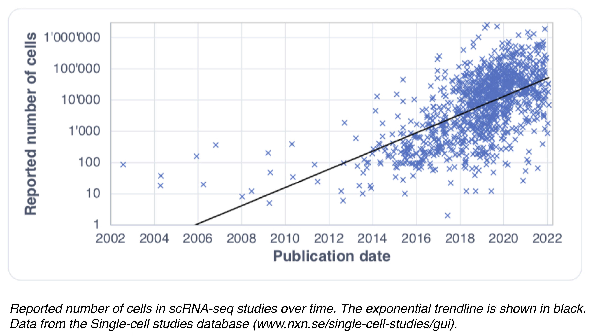

```{r setup, include=FALSE}
knitr::opts_chunk$set(echo = TRUE)
```

```{r echo=FALSE}

```

## Metacell concept 


The exponential scaling of scRNA-seq data represents an important hurdle for downstream analyses.
One of the solutions to facilitate the analysis of large-scale and noisy scRNA-seq data is to merge transcriptionally highly similar cells into *metacells*. This concept was first introduced by [*Baran et al., 2019*](https://doi.org/10.1186/s13059-019-1812-2) (MetaCell) and by [*Iacono et al., 2018*](https://doi:10.1101/gr.230771.117) (bigSCale). More recent methods to build *metacells* have been described in [*Ben-Kiki et al. 2022*](https://doi.org/10.1186/s13059-022-02667-1) (MetaCell2), [*Bilous et al., 2022*](https://www.biorxiv.org/content/10.1101/2021.06.07.447430v2) (SuperCell) and [*Persad et al., 2022*](https://www.biorxiv.org/content/10.1101/2022.04.02.486748v1) (SEACells). Despite some differences in the implementation, all the methods are network-based and can be summarized as follows: 

**1.** A single-cell network is computed based on cell-to-cell similarity (in transcriptomic space)

**2.** Highly similar cells are identified as those forming dense regions in the single-cell network and merged together into metacells (coarse-graining)

**3.** Transcriptomic information within each metacell is combined (average or sum).

**4.** Metacell data are used for the downstream analyses instead of large-scale single-cell data

```{r echo=FALSE}
knitr::include_graphics("plots/1.png")
```

Unlike clustering, the aim of metacells is not to identify large groups of cells that comprehensively capture biological concepts, like cell types, but to merge cells that share highly similar profiles, and may carry repetitive information. **Therefore metacells represent a compromise structure that optimally remove redundant information in scRNA-seq data while preserving the biologically relevant heterogeneity.**

An important concept when building metacells is the **graining level** (*γ*), which we define as the ratio between the number of single cells in the initial data and the number of metacells. Depending on the algorithms, the graining level is either specified by the user (in [bigSCale](https://github.com/iaconogi/bigSCale2), [SuperCell](https://github.com/GfellerLab/SuperCell) and [SEACells](https://github.com/dpeerlab/SEACells)) or imposed by the algorithm (in [Metacell](https://github.com/tanaylab/metacell) and [Metacell-2](https://github.com/tanaylab/metacells)).


## Tutorial structure

We will start with [a first example of how to build and analyse metacells](https://github.com/GfellerLab/SIB_workshop/blob/main/workbooks/Workbook_1__cancer_cell_lines.md), applying a simplification approach to the *cell lines* dataset ([Tian et al](https://www.nature.com/articles/s41592-019-0425-8)). This workbook includes a standard scRNA-seq data analysis pipeline with Seurat (i.e., visualization, clustering, differential expression analysis, gene-gene correlation) followed by building metacells and performing the same standard downstream analyses to compare the results obtained at the single-cell and the metacells levels. 

The construction of metacells will be done with the algorithm developed in our group, called [SuperCell](https://github.com/GfellerLab/SuperCell), but we also provide scripts to simplify the same dataset with other methods, such as [Metacell-2](https://github.com/GfellerLab/SIB_workshop/blob/main/workbooks/Notebook_1_1__MetaCell2.ipynb) and [SEACells](https://github.com/GfellerLab/SIB_workshop/blob/main/workbooks/Notebook_1_2__SEACells.ipynb). Since those methods are Python-based, to avoid any issues with data transferring and software installation, we provide pre-computed results of those two methods that you can use for the downstream analysis. 

Next, we demonstrate the use of metacells for the analysis of a more realistic dataset of *COVID-19* patient blood samples followed by the demonstration of how [metacells can be used for data integration](https://github.com/GfellerLab/SIB_workshop/blob/main/workbooks/Workbook_2__COVID19_integration.md). For this, we apply metacell to 26 COVID-19 samples and perform data integration of a total of $\sim 200'000$ cells at the metacell level. This part of the tutorial will illustrate the power of metacells on a dataset that is more challenging to analyse at the single-cell level due to its large size. You can try to integrate this dataset at the single-cell level using [this workbook](https://github.com/GfellerLab/SIB_workshop/blob/main/workbooks/Workbook_2_1__COVID19_integration_single_cells.Rmd).

Finally, we provide a workbook of [metacell usage for the RNA velocity](https://github.com/GfellerLab/SIB_workshop/blob/main/workbooks/Workbook_3__RNA_velocity.md) that you may investigate yourself. Please, keep in mind that it requires the installation of [velocyto.R](http://velocyto.org).

### Summary:
There are 2 main and 1 supplementary workbooks:

* [Workbook 1](https://github.com/GfellerLab/SIB_workshop/blob/main/workbooks/Workbook_1__cancer_cell_lines.md)
* [Workbook 2](https://github.com/GfellerLab/SIB_workshop/blob/main/workbooks/Workbook_2__COVID19_integration.md)
* [Workbook 3](https://github.com/GfellerLab/SIB_workshop/blob/main/workbooks/Workbook_3__RNA_velocity.md)

And 2 notebooks to build metacells using alternative methods:

* [Notebook 1.1: building metacells with Metacell-2](https://github.com/GfellerLab/SIB_workshop/blob/main/workbooks/Notebook_1_1__MetaCell2.ipynb)
* [Notebook 1.2: building metacells with SEACells](https://github.com/GfellerLab/SIB_workshop/blob/main/workbooks/Notebook_1_2__SEACells.ipynb)

Or performing data integration at the single-cell level:

* [Workbook 2.1](https://github.com/GfellerLab/SIB_workshop/blob/main/workbooks/Workbook_2_1__COVID19_integration_single_cells.Rmd)

## Installation (Prerequisites)

We expect you to have RStudio and R > 4.0.0 to be installed.

For the smooth run of the tutorial, we ask you:

1. to clone this repository:

```{bash eval=FALSE, include=TRUE}
git clone https://github.com/GfellerLab/SIB_workshop.git
```

2. to download data and pre-processed objects of Metacell-2 and SEACell outputs into `/data` folder:
```{bash eval=FALSE, include=TRUE}
cd SIB_workshop
curl -o data.zip https://drive.switch.ch/index.php/s/rOofK4o9QqFm8Gb/download
unzip data.zip
```

3. run RStudio

```{bash eval=FALSE, include=TRUE}
open SIB_workshop.Rproj
```

4. install some R packages by running the following R commands:
```{r eval=FALSE, include=TRUE}
install.packages(c('Seurat','dplyr','ggplot2','harmony','reshape2', 'remotes'))
if (!require("BiocManager", quietly = TRUE))
   install.packages("BiocManager")
BiocManager::install("SingleCellExperiment")
remotes::install_github("GfellerLab/SuperCell")
```

5. and open file `/workbooks/Workbook_1__cancer_cell_lines.Rmd`.

#### If you have any issues with installation step **4**
If you encounter issues with the previous installations, you can also install [conda](https://docs.conda.io/projects/conda/en/latest/user-guide/install/index.html#regular-installation) and follow the next steps:

3.  build and activate the following conda environment by running:
```{bash eval=FALSE, include=TRUE}
conda env create -n metacell_tutorial --file environment.yml

conda activate metacell_tutorial 
```


4. run RStudio
```{bach eval=FALSE, include=TRUE}
open open SIB_workshop.Rproj
```

5. and open file `/workbooks/Workbook_1__cancer_cell_lines.Rmd`.