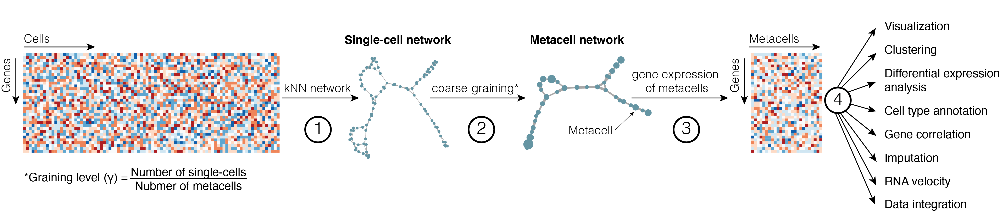

Simplifying large and complex single-cell RNA-Seq data with metacells
================

<!-- -->

## Metacell concept

The exponential scaling of scRNA-seq data represents an important hurdle
for downstream analyses. One of the solutions to simplify large-scale
and noisy scRNA-seq data is to merge transcriptionally highly similar cells
into *metacells*. The concept was first introduced by [*Baran et al.,
2019*](https://doi.org/10.1186/s13059-019-1812-2) (MetaCell1.0) and by [*Iacono et
al., 2018*](https://doi:10.1101/gr.230771.117) (bigSCale). More recent methods to build
*metacells* are presented in [*Ben-Kiki et
al. 2022*](https://doi.org/10.1186/s13059-022-02667-1) (MetaCell2.0), [*Bilous et al.,
2022*](https://www.biorxiv.org/content/10.1101/2021.06.07.447430v2) (SuperCell) and
[*Persad et al.,
2022*](https://www.biorxiv.org/content/10.1101/2022.04.02.486748v1) (SEACells).
Despite some differences in the implementation, all methods are
network-based and can be summarized as follows:

**1.** A single-cell network is computed based on cell-to-cell
similarity (in transcriptomic space)

**2.** Highly similar cells are identified as those forming dense
regions in the single-cell network

**3.** Transcriptomic information within identified metacells is merged
(i.e., summed up or averaged)

**4.** Metacell data are used for the downstream analyses instead of
large-scale single-cell data

<!-- -->

Unlike clustering, the aim of metacells is not to identify large groups of cells that comprehensively capture biological concepts, like cell types, but to merge cells that share highly similar profiles, and may carry repetitive information. Therefore metacells represent a coarse-grained structure that optimally remove redunant information in scRNA-Seq data while preserving the biologically relevant heterogeneity.

An important concept when building metacells is the **graining level** (*γ*),
which we define as the ratio between the number of single cells in the
initial data and the number of metacells. Depending on the
simplification method, the graining level is either specified by the
user (in [bigSCale](https://github.com/iaconogi/bigSCale2),
[SuperCell](https://github.com/GfellerLab/SuperCell) and
[SEACells](https://github.com/dpeerlab/SEACells)) or imposed by the algorithm (in
[Metacell](https://github.com/tanaylab/metacell) and
[Metacell-2](https://github.com/tanaylab/metacells)).

## Tutorial structure

We will start with [a first example of how to build and analyse metacells](https://github.com/GfellerLab/SIB_workshop/blob/main/workbooks/Cell_lines.md),
using a scRNA-Seq dataset of five *cell lines* [Tian et al](https://www.nature.com/articles/s41592-019-0425-8). This
workbook includes a standard scRNA-seq data analysis pipeline with
Seurat (i.e., visualization, clustering, differential expression
analysis, gene-gene correlation) followed by computing metacells and performing the same standard downstream
analysis to compare the results obtained at the
single-cell and the metacells levels.

The construction of metacells will be done with the algorithm developed in our
group, called [SuperCell](https://github.com/GfellerLab/SuperCell), but
we also provide scripts to analyse the same dataset with other methods,
such as
[Metacell-2](https://github.com/GfellerLab/SIB_workshop/blob/main/workbooks/Metacell2.ipynb)
and
[SEACells](https://github.com/GfellerLab/SIB_workshop/blob/main/workbooks/SEACells.ipynb).
Since those methods are Python-based, to avoid any issues with data
transferring and software installation, we provide pre-computed results
of those two methods that you can use for the downstream analysis.

Next, we demonstrate the use of metacells for the analysis of a more
realistic dataset of *COVID-19* patient blood samples followed by the
demonstration of how [metacells can be used for data integration](). For
this, we apply metacell simplification to N COVID-19 samples and perform
data integration of a total of NN cells at the metacell level. We hope
you appreciate that the integration of such a large dataset is possible
only at the metacell, but not at the single-cell level.

Finally, we provide a workbook of [metacell usage for the RNA
velocity](https://github.com/GfellerLab/SIB_workshop/blob/main/workbooks/RNAvelocity_for_metacells.md)
that you may investigate yourself. Please, keep in mind that it requires
the installation of [velocyto.R](http://velocyto.org).

### Summary:

There are 2 main and 1 supplementary workbooks:

-   [workbook
    1](https://github.com/GfellerLab/SIB_workshop/blob/main/workbooks/Cell_lines.md)
-   [workbook 2]()
-   [workbook
    3](https://github.com/GfellerLab/SIB_workshop/blob/main/workbooks/RNAvelocity_for_metacells.md)

And 2 notebooks to build metacells using alternative methods:

-   [building metacells with
    Metacell-2](https://github.com/GfellerLab/SIB_workshop/blob/main/workbooks/Metacell2.ipynb)
-   [building metacells with
    SEACells](https://github.com/GfellerLab/SIB_workshop/blob/main/workbooks/SEACells.ipynb)

## Installation (Prerequisites)

We expect you to have RStudio and R \> 4.0.0 to be installed.

For the smooth run of the tutorial, we ask you:

1.  to clone this repository:

``` bash
gh repo clone GfellerLab/SIB_workshop
```

2.  to download data and pre-processed objects of Metacell-2 and SEACell
    outputs into `/data` folder:

``` bash
cd SIB_workshop
curl -o data.zip https://drive.switch.ch/index.php/s/rOofK4o9QqFm8Gb/download
unzip data.zip
```

3.  to install and activate the following conda environment by running:

``` bash
conda env create -n metacell_tutorial --file environment.yml

conda activate metacell_tutorial 
```

4.  to run RStudio

``` bach
open -na Rstudio
```

5.  and to open file `/workbooks/Cell_lines.Rmd`.
