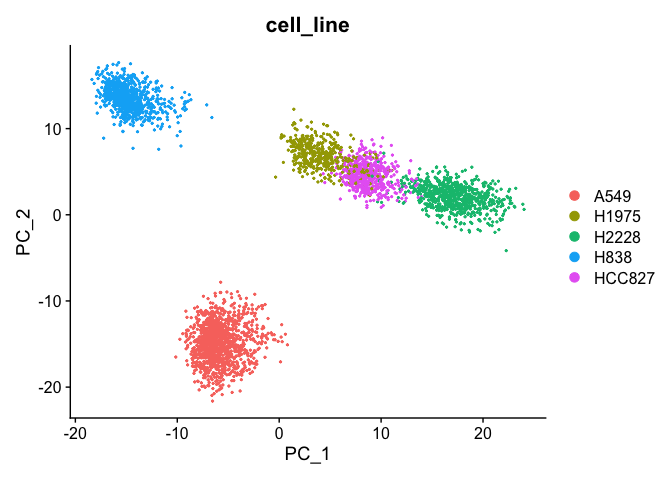
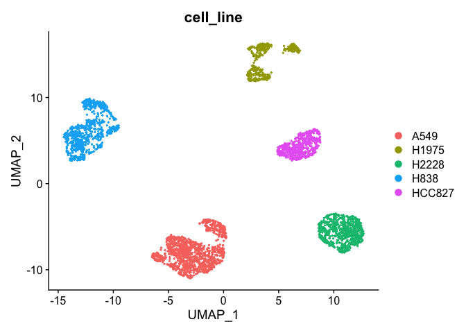
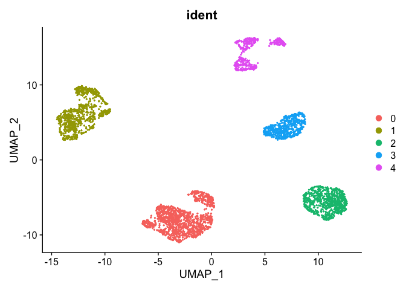
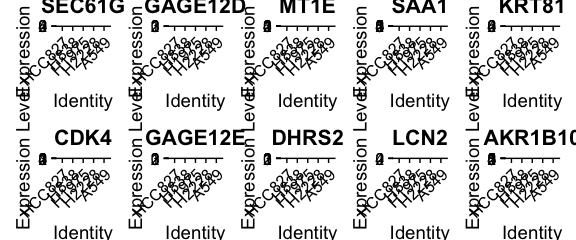

Suggested course structute:
===========================

We firtstly run a **standard scRNA-seq data analysis pipeline** (i.e.,
data normalizatoion, feature selection, dimensionality reduction,
visualization, clustering and differential expression analysis) usign
[Seurat](https://satijalab.org/seurat/index.html) framework. Then, we
**simplify** the same dataset by computing *metacells* (i.e., grouping
transcriptionally highly simiar sigle cells into metacells). For this we
will use a method developed in our group called
[SuperCell](https://github.com/GfellerLab/SuperCell). We will also
provide some hints on how *metacells* can be coumputed using alternative
approaches including [MetaCell](https://github.com/tanaylab/metacell),
[Metacell2.0](https://metacells.readthedocs.io/en/latest/readme.html),
and [SEACell](https://github.com/dpeerlab/SEACells). We will then run
**‘a standard scRNA-seq data analysis pipeline’** adjusted to the
metacell data and compare the results ontained at the single-cell and
the metacell levels.

Then, they can use the code we provide to build metacells for their own
datasets

------------------------------------------------------------------------

**Some options:** \* Alternatiely, we can run an adjusted (ie.,
sample-weighted) pipeline for metacells or/and a standard (ie, Seurat).
\* Subsampling at the same graining level -&gt; compare the results to
those obtained at the single-cell level

-   We could provide an example of how metacell can be used for
    RNA-velocity (on another dataset)
-   How metacells can be used for data integration (if we have nice
    examples)

-   when and if analysing their own data, make sure to intoduce
    `cell.annotation` and `cell.split.condition` arguments of
    `SCimplify()` to avoid mixing of annotated cell types / conditions
    within metacells.

------------------------------------------------------------------------

``` r
# make a data library (cell lines or Zilionis)
library(SuperCell)
library(Seurat)
library(dplyr)
```

``` r
proj.name    <- 'cell_lines'
data.folder  <- file.path("..", "data", proj.name)

# load single-cell (sc) count matrix and cell metadata 
sc.counts <- readRDS(file.path(data.folder, "sc_counts_filtered.Rds"))
sc.meta   <- readRDS(file.path(data.folder, "sc_meta_filtered.Rds"))

# Make sure metadata and count matrix have the same cells in the same order
if(!identical(rownames(sc.meta), colnames(sc.counts))){
  stop("Metadata (`sc.meta`) does not correspond to the count matrix (`sc.counts`)")
}
```

Single-cell level
=================

Standard downstream analysis
----------------------------

Run a brief analysis at the single-cell level, lets use the common
[Seurat](https://satijalab.org/seurat/index.html) pipeline <span
style="color: green;"> depending on the audience experience with Seurat,
we can either separetely run these steps of the pre-processing or ‘skip
it’ with ‘one-line’ command. For the memont, it is more step-by -step
pre-processing, that can be replaced with : </span>
`sc <-  NormalizeData(sc) %>% FindVariableFeatures(selection.method = "disp", nfeatures = 1000, verbose=FALSE) %>% ScaleData(verbose=FALSE) %>% RunPCA(verbose=FALSE)`

``` r
set.seed(12345)
sc <- CreateSeuratObject(counts = sc.counts, project = proj.name, meta.data = sc.meta)
sc
```

    ## An object of class Seurat 
    ## 11786 features across 3822 samples within 1 assay 
    ## Active assay: RNA (11786 features, 0 variable features)

Data normalization
------------------

``` r
sc <- NormalizeData(sc)

sc <- FindVariableFeatures(
  sc, 
  selection.method = "disp", # ""
  nfeatures = 1000
  )

hvg <- VariableFeatures(sc)
# plot variable features 
plot1 <- VariableFeaturePlot(sc)
LabelPoints(plot = plot1, points = hvg[1:20], repel = TRUE)
```

    ## When using repel, set xnudge and ynudge to 0 for optimal results

    ## Warning: Removed 2 rows containing missing values (geom_point).

    ## Warning: Removed 2 rows containing missing values (geom_text_repel).

    ## Warning: ggrepel: 4 unlabeled data points (too many overlaps). Consider
    ## increasing max.overlaps


Scaling and dimensionality redution
-----------------------------------

``` r
sc <- ScaleData(sc)
```

    ## Centering and scaling data matrix

``` r
sc <- RunPCA(sc)
```

    ## PC_ 1 
    ## Positive:  RPL13, RPL13P12, HLA-B, XAGE1B, LCN2, HLA-C, OCIAD2, RPS15A, PDZK1IP1, IFI16 
    ##     SAA1, RPL9P9, RPS15AP38, RPS14, PSMB9, CD74, BST2, RPL35, RPL37, RPL37A 
    ##     CXCL1, ADGRF1, ZFP36L1, G0S2, RPL35P5, PSMB8, AC073861.1, CD47, BIRC3, B2M 
    ## Negative:  TPM2, RPSAP19, SNRPD2, SRGN, MT-RNR1, RPSA, AP1M2, NME4, ATP5F1E, KRT10 
    ##     TMA7, ID3, GTF2A2, GSTP1, GAGE12E, GAGE12D, GAGE12G, GAGE2A, GAGE2E, OST4 
    ##     MLLT11, GAGE12J, GAGE12H, PFN1, PDCD5, CTAG2, DSTN, MAGEA6, HSPE1, GAGE13 
    ## PC_ 2 
    ## Positive:  AC018738.1, IFITM3, MDK, RPS28, UBL5, MT2A, RPL35A, SH3BGRL3, RPS21, MYL9 
    ##     RPS2, OAZ1, LIMA1, CT45A3, LY6K, CCDC85B, GAGE12D, WDR66, GAGE12E, RPS2P55 
    ##     GAGE12G, RPL11, RPL12, AC107983.1, AC024293.1, GAGE2A, RPL18AP3, GAGE12H, GAGE12J, GAGE2E 
    ## Negative:  AKR1B10, AKR1C2, AKR1C3, ALDH1A1, AKR1C1, GPX2, KRT81, G6PD, AGR2, ALDH3A1 
    ##     S100A4, CPLX2, ANXA4, RPS4Y1, CA12, PPP1R14A, KRT8, KRT18P11, BLVRB, KRT18 
    ##     TESC, KRT18P17, TKT, PDLIM5, PON2, UGDH, KRT18P10, SPINT2, TXN, NQO1 
    ## PC_ 3 
    ## Positive:  WFDC21P, RPS20, PTGR1, VIM, MTDH, FTL, MAP1B, CXCL1, CD74, RPL30 
    ##     HINT1, CYP1B1, UCHL1, BIRC3, CXCL6, FTH1, HLA-DRB5, ST3GAL4, CXCL8, CPD 
    ##     FEZ1, HLA-DRA, HLA-DRB1, SLPI, KTN1, C1S, IFITM2, AC004870.2, CLDN11, IFI27L2 
    ## Negative:  CDKN2A, SEC61G, RPL26, RPL26P19, CLDN7, SFTA2, AL121871.1, EPCAM, CCT6A, RPL7P9 
    ##     CHCHD2, RPS7, VOPP1, RPS7P10, UCA1, OS9, C1QBP, KRT7, RPL7, PIP4K2C 
    ##     EGFR, SNHG6, ELOC, RPS7P1, CDK4, LPCAT1, TXNDC17, TBK1, NAPSA, LAD1 
    ## PC_ 4 
    ## Positive:  RPL29, TMSB10, RPLP1, AC099560.2, MT-ND4, AC099336.2, AC005912.1, OST4, RPL28, RPS28P7 
    ##     AC016739.1, RPL41, TMEM134, MT-ATP6, MT-CO2, MT-ND2, PEG10, MT-CO3, LRRC75A-AS1, MT-ND1 
    ##     SNHG5, TNNT1, TOMM7, UQCR10, DHRS2, AL049870.3, APCDD1L-AS1, SERF2, AC092069.1, METRN 
    ## Negative:  ENO1, PRDX1, PSMB1, HSP90AB1, LDHB, TUBB, GAPDH, HSP90AA1, PSMB3, CCT5 
    ##     RAN, NPM1, TUBB4B, CCT2, HSPA8, CCT8, PSMA5, PSMA4, PRDX6, SLC25A3 
    ##     TPI1, PSMA3, HSPD1, PSMC4, TALDO1, CACYBP, LDHA, HNRNPA2B1, UBC, TUBA4A 
    ## PC_ 5 
    ## Positive:  DHRS2, MT1E, ZNF880, LGALS1, CT45A9, AL049870.3, CT45A2, LINC01511, PEG10, UBE2SP1 
    ##     AC011447.3, UBE2S, SFN, MRPL11, ACTB, CYCS, LSM5, SNHG5, H3F3B, NDUFA4 
    ##     CALM1, TUBA1B, APCDD1L-AS1, ZNF114, PCLAF, TCN1, XAGE1A, MT1L, NDUFA3, JPT1 
    ## Negative:  RPL21P16, RPS27A, RPL31, RPL21P28, RPL19, RPS8, RPS6, RPS27AP16, RPL13A, BEX3 
    ##     RPL23, RPL5P34, TPT1, RPL18AP3, RPL5, AL049873.1, RPS16, RPL7P9, RPS19, RPL11 
    ##     AC079250.1, RPL3P4, SFTA2, AC010343.1, RPL7, YBX1, RPL5P12, RPL13AP5, RPL13AP25, AC116533.1

``` r
# Plot PCA (2D representation of scRNA-seq data) colored by cell line
DimPlot(sc, reduction = "pca", group.by = "cell_line")
```



UMAP (non-linear dimensionaloty reduction)
------------------------------------------

``` r
sc <- RunUMAP(sc,  dims = 1:10)
```

    ## Warning: The default method for RunUMAP has changed from calling Python UMAP via reticulate to the R-native UWOT using the cosine metric
    ## To use Python UMAP via reticulate, set umap.method to 'umap-learn' and metric to 'correlation'
    ## This message will be shown once per session

    ## 18:03:23 UMAP embedding parameters a = 0.9922 b = 1.112

    ## 18:03:23 Read 3822 rows and found 10 numeric columns

    ## 18:03:23 Using Annoy for neighbor search, n_neighbors = 30

    ## 18:03:23 Building Annoy index with metric = cosine, n_trees = 50

    ## 0%   10   20   30   40   50   60   70   80   90   100%

    ## [----|----|----|----|----|----|----|----|----|----|

    ## **************************************************|
    ## 18:03:23 Writing NN index file to temp file /var/folders/g3/m1nhnz5910s9mckg3ymbz_b80000gn/T//RtmpEmWfs8/file641f5665c3ef
    ## 18:03:23 Searching Annoy index using 1 thread, search_k = 3000
    ## 18:03:25 Annoy recall = 100%
    ## 18:03:25 Commencing smooth kNN distance calibration using 1 thread
    ## 18:03:26 Found 5 connected components, falling back to 'spca' initialization with init_sdev = 1
    ## 18:03:26 Initializing from PCA
    ## 18:03:26 PCA: 2 components explained 52.14% variance
    ## 18:03:26 Commencing optimization for 500 epochs, with 145790 positive edges
    ## 18:03:35 Optimization finished

``` r
# Plot UMAP (2D representation of scRNA-seq data) colored by cell line
DimPlot(sc, reduction = "umap", group.by = "cell_line")
```



Clustering single-cell data
---------------------------

``` r
sc <- FindNeighbors(sc, dims = 1:10)
```

    ## Computing nearest neighbor graph

    ## Computing SNN

``` r
sc <- FindClusters(sc, resolution = 0.05)
```

    ## Modularity Optimizer version 1.3.0 by Ludo Waltman and Nees Jan van Eck
    ## 
    ## Number of nodes: 3822
    ## Number of edges: 121361
    ## 
    ## Running Louvain algorithm...
    ## Maximum modularity in 10 random starts: 0.9890
    ## Number of communities: 5
    ## Elapsed time: 0 seconds

``` r
# As it is a toy example with well defined cell types (i.e., cell lines), unsupervised clustering fully recapitulates cell line annotation 
table(sc@active.ident, sc$cell_line)
```

    ##    
    ##     A549 H1975 H2228 H838 HCC827
    ##   0 1237     0     0    0      0
    ##   1    0     0     0  841      0
    ##   2    0     0   744    0      0
    ##   3    0     0     0    0    571
    ##   4    0   429     0    0      0

``` r
DimPlot(sc, reduction = "umap", group.by = "ident")
```

 \#\#
Find markers of cell lines

``` r
# Set idents to cell lines (as clusters are the same as cell lines)
Idents(sc) <- "cell_line"

# Compute upregulated genes in each cell line (versus other cells)
sc.all.markers <-  FindAllMarkers(sc, only.pos = TRUE, min.pct = 0.25, logfc.threshold = 0.25, test.use = "t")
```

    ## Calculating cluster HCC827

    ## Calculating cluster H838

    ## Calculating cluster H1975

    ## Calculating cluster H2228

    ## Calculating cluster A549

``` r
saveRDS(sc.all.markers, file = file.path(data.folder, "output", "sc_all_markers.Rds"))

# Load markers (backup)
# sc.all.markers <- readRDS(file = file.path(data.folder, "output", "sc_all_markers.Rds"))

# Top markers (select top markers of each cell line)
sc.top.markers <- sc.all.markers %>%
   group_by(cluster) %>%
    slice_max(n = 2, order_by = avg_log2FC)

sc.top.markers
```

    ## # A tibble: 10 × 7
    ## # Groups:   cluster [5]
    ##        p_val avg_log2FC pct.1 pct.2 p_val_adj cluster gene   
    ##        <dbl>      <dbl> <dbl> <dbl>     <dbl> <fct>   <chr>  
    ##  1 0               4.17 1     0.996 0         HCC827  SEC61G 
    ##  2 0               3.05 0.998 0.941 0         HCC827  CDK4   
    ##  3 0               4.20 1     0.245 0         H838    GAGE12D
    ##  4 0               4.01 1     0.176 0         H838    GAGE12E
    ##  5 1.05e-180       3.26 0.991 0.323 1.24e-176 H1975   MT1E   
    ##  6 1.42e-142       3.07 0.963 0.083 1.68e-138 H1975   DHRS2  
    ##  7 0               4.08 0.997 0.371 0         H2228   SAA1   
    ##  8 0               3.94 0.999 0.625 0         H2228   LCN2   
    ##  9 0               5.56 0.998 0.775 0         A549    KRT81  
    ## 10 0               5.15 1     0.675 0         A549    AKR1B10

Plot the expression of found markers
------------------------------------

``` r
VlnPlot(sc, features = sc.top.markers$gene[c(seq(1, 9, 2), seq(2, 10, 2))], ncol = 5, pt.size = 0.0)
```



Data simplification (coarse-graining)
=====================================

Here we compute metacells using our method called
(SuperCell)\[<a href="https://github.com/GfellerLab/SuperCell" class="uri">https://github.com/GfellerLab/SuperCell</a>\],
but equally, metacells can be computed with
(Metacell)\[<a href="https://github.com/tanaylab/metacell" class="uri">https://github.com/tanaylab/metacell</a>\],
(Metacell2.0)\[<a href="https://metacells.readthedocs.io/en/latest/readme.html" class="uri">https://metacells.readthedocs.io/en/latest/readme.html</a>\]
or
(SEACell)\[<a href="https://github.com/dpeerlab/SEACells" class="uri">https://github.com/dpeerlab/SEACells</a>\]
algorithms and we will see some examples below.

``` r
gamma <- 20 # Graining level

# Compute metacells using SuperCell package
MC <- SCimplify(
  X = GetAssayData(sc), # single-cell log-normalized gene expression data
  genes.use = hvg, 
  gamma = gamma,
  n.pc = 10
)

# Compute gene expression of metacells by simply averaging gene expression within each metacell

MC.ge <- supercell_GE(
  ge = GetAssayData(sc),
  groups = MC$membership
)

# Alternatively, counts can be averaged (summed up) followed by a lognormalization step (this approach is used in the MetaCell and SEACell algorithms)
if(0){
  MC.counts <- supercell_GE(
    ge = GetAssayData(sc, slot = "counts"),
    groups = MC$membership
  )
  
  MC.ge <- scater::normalizeCounts(MC.counts, size.factor = 1e4)
}
```

Alternatively, metacells can be computed using
(Metacell)\[<a href="https://github.com/tanaylab/metacell" class="uri">https://github.com/tanaylab/metacell</a>\],
(Metacell2.0)\[<a href="https://metacells.readthedocs.io/en/latest/readme.html" class="uri">https://metacells.readthedocs.io/en/latest/readme.html</a>\]
or
(SEACell)\[<a href="https://github.com/dpeerlab/SEACells" class="uri">https://github.com/dpeerlab/SEACells</a>\]
algorithms.
