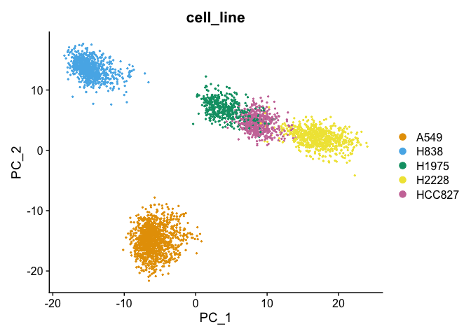
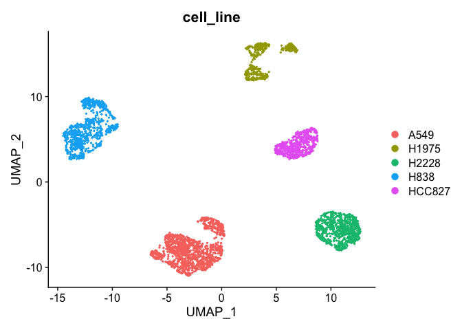
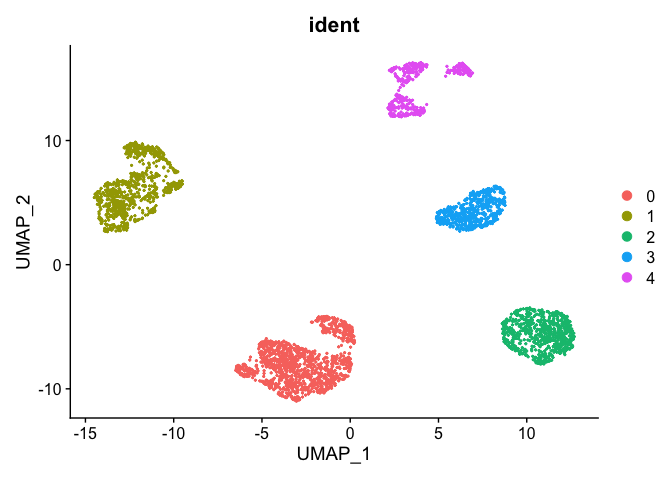
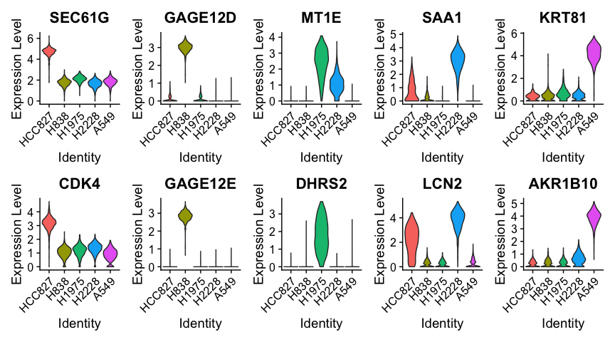
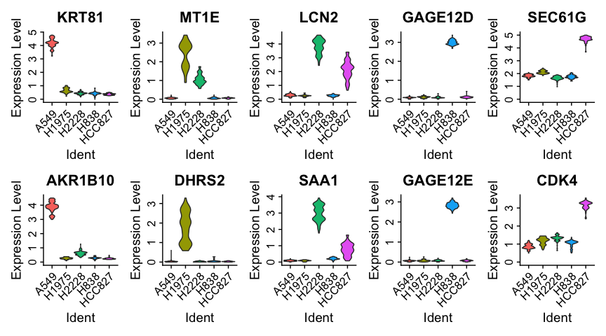
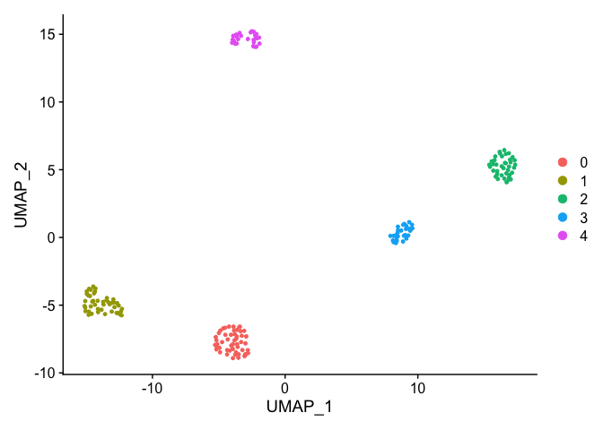
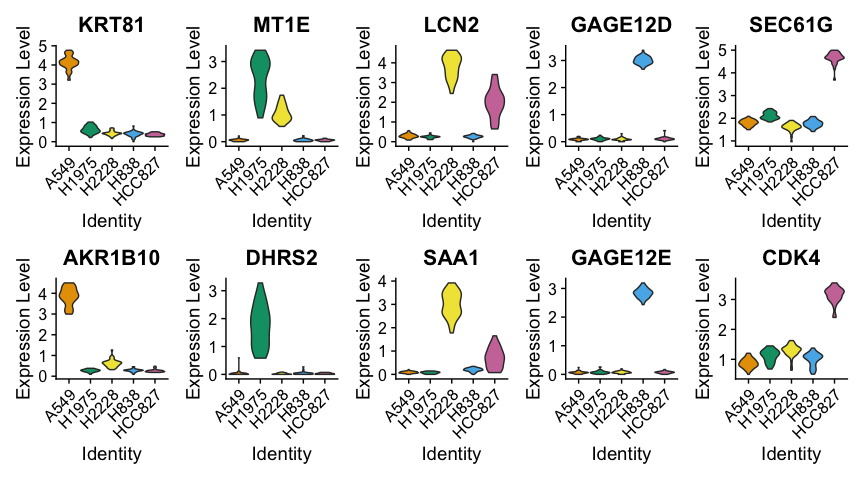
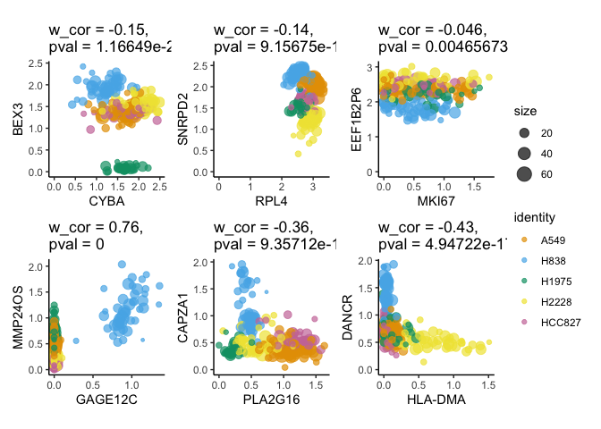
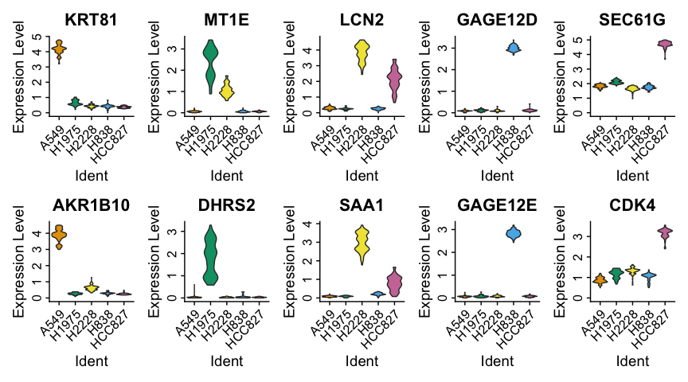

-   [Suggested course structute:](#suggested-course-structute)
-   [TO DO:](#to-do)
-   [Single-cell level](#single-cell-level)
    -   [Standard downstream analysis](#standard-downstream-analysis)
        -   [Pre-processing](#pre-processing)
        -   [UMAP (non-linear dimensionality
            reduction)](#umap-non-linear-dimensionality-reduction)
        -   [Clustering](#clustering)
        -   [Differential expression analysis (!? TO remove this part if
            COVID dataset contains such
            analysis)](#differential-expression-analysis-to-remove-this-part-if-covid-dataset-contains-such-analysis)
-   [Data simplification (coarse-graining) – Construction of
    *metacells*](#data-simplification-coarse-graining-construction-of-metacells)
    -   [Downstream analysis of
        metacells](#downstream-analysis-of-metacells)
        -   [Pre-processing](#pre-processing-1)
    -   [Alternative or Sample-weighted downstream analysis of
        *metacells*](#alternative-or-sample-weighted-downstream-analysis-of-metacells)
        -   [Dimensionality reduction](#dimensionality-reduction)
        -   [Clustering (sample-weighted
            hclust)](#clustering-sample-weighted-hclust)
        -   [Differential expression analysis in
            metacells](#differential-expression-analysis-in-metacells)
-   [Alternative constructions of
    metacells](#alternative-constructions-of-metacells)
    -   [Metacell construction with
        Metacell-2](#metacell-construction-with-metacell-2)
    -   [Metacell construction with
        SEACells](#metacell-construction-with-seacells)

# Suggested course structute:

We first run a **standard scRNA-seq data analysis pipeline** (i.e., data
normalization, feature selection, dimensionality reduction,
visualization, clustering and differential expression analysis) using
the [Seurat](https://satijalab.org/seurat/index.html) framework. Then,
we **simplify** the same dataset by computing *metacells* (i.e.,
grouping transcriptionally highly similar single cells into metacells).
For this, we will use a method developed in our group called
[SuperCell](https://github.com/GfellerLab/SuperCell). We will also
provide some hints on how *metacells* can be computed using alternative
approaches including [MetaCell](https://github.com/tanaylab/metacell),
[Metacell-2](https://metacells.readthedocs.io/en/latest/readme.html),
and [SEACell](https://github.com/dpeerlab/SEACells). We will then run
**‘a standard scRNA-seq data analysis pipeline’** adjusted to the
metacell data and compare the results obtained at the single-cell and
the metacell levels.

Then, the participant can use the code we provide to build metacells and
run some basic analysis for their datasets

------------------------------------------------------------------------

**Some options:**

-   Alternatively, we can run an adjusted (ie., sample-weighted)
    pipeline for metacells or/and a standard (ie, Seurat).

-   Subsampling at the same graining level -> compare the results to
    those obtained at the single-cell level

-   We could provide an example of how metacell can be used for
    RNA-velocity (on another dataset)

-   How metacells can be used for data integration (if we have nice
    examples)

-   when and if analyzing their own data, make sure to introduce
    `cell.annotation` and `cell.split.condition` arguments of
    `SCimplify()` to avoid mixing of annotated cell types / conditions
    within metacells.

------------------------------------------------------------------------

# TO DO:

-   <s>make `supercell_DimPlot()`</s> push `supercell_DimPlot()`

-   match colors for cell lines and clusters

-   write ‘standard (not sample-weighted)’ analysis on metacells

-   code for MC2 and SEAcells computation (to provide a link), save and
    provide results of metcell membership computed with MC2 and SEACell

-   dataset for demo of gene-gene correlation/RNA velocity/ Data
    integratoin for more advanced steps of the analysis

-   ATAC-seq example ?

<!-- -->

    # make a data library (cell lines or Zilionis)
    library(SuperCell)
    library(Seurat)
    library(dplyr)

    proj.name    <- 'cell_lines'
    .color.cell.type <- c("A549" = "#E69F00", "H838" = "#56B4E9", "H1975" = "#009E73", "H2228" = "#F0E442", "HCC827" = "#CC79A7")
    data.folder  <- file.path("..", "data", proj.name)

    # load single-cell (sc) count matrix and cell metadata 
    sc.counts <- readRDS(file.path(data.folder, "sc_counts_filtered.Rds"))
    sc.meta   <- readRDS(file.path(data.folder, "sc_meta_filtered.Rds"))

    # Make sure metadata and count matrix have the same cells in the same order
    if(!identical(rownames(sc.meta), colnames(sc.counts))){
      stop("Metadata (`sc.meta`) does not correspond to the count matrix (`sc.counts`)")
    }

# Single-cell level

## Standard downstream analysis

Run a brief analysis at the single-cell level, lets’s use the common
[Seurat](https://satijalab.org/seurat/index.html) pipeline

 depending on the participants’ experience
with Seurat, we can either separately run these steps of the
pre-processing or ‘skip it’ with ‘one-line’ command. For the moment, it
is more step-by -step pre-processing, that can be replaced with :

`sc <-  NormalizeData(sc, verbose=FALSE) %>% FindVariableFeatures(selection.method = "disp", nfeatures = 1000, verbose=FALSE) %>% ScaleData(verbose=FALSE) %>% RunPCA(verbose=FALSE)`

    set.seed(12345)
    sc <- CreateSeuratObject(counts = sc.counts, project = proj.name, meta.data = sc.meta)
    sc

    ## An object of class Seurat 
    ## 11786 features across 3822 samples within 1 assay 
    ## Active assay: RNA (11786 features, 0 variable features)

### Pre-processing

#### Data normalization

    sc <- NormalizeData(sc, verbose=FALSE)

    sc <- FindVariableFeatures(
      sc, 
      selection.method = "disp", # "vst" is default
      nfeatures = 1000,
      verbose=FALSE
      )

    hvg <- VariableFeatures(sc, verbose=FALSE)

    # Plot variable features 
    plot1 <- VariableFeaturePlot(sc)
    LabelPoints(plot = plot1, points = hvg[1:20], repel = TRUE)

#### Scaling and dimensionality redution

    sc <- ScaleData(sc, verbose=FALSE)
    sc <- RunPCA(sc, verbose=FALSE)

    # Plot PCA (2D representation of scRNA-seq data) colored by cell line
    DimPlot(sc, reduction = "pca", group.by = "cell_line", cols = .color.cell.type)

### UMAP (non-linear dimensionality reduction)

    sc <- RunUMAP(sc,  dims = 1:10)

    # Plot UMAP (2D representation of scRNA-seq data) colored by cell line
    DimPlot(sc, reduction = "umap", group.by = "cell_line", cols = .color.cell.type)

### Clustering

    sc <- FindNeighbors(sc, dims = 1:10)
    sc <- FindClusters(sc, resolution = 0.05)

    ## Modularity Optimizer version 1.3.0 by Ludo Waltman and Nees Jan van Eck
    ## 
    ## Number of nodes: 3822
    ## Number of edges: 121361
    ## 
    ## Running Louvain algorithm...
    ## Maximum modularity in 10 random starts: 0.9890
    ## Number of communities: 5
    ## Elapsed time: 0 seconds

    # As it is a toy example with well defined cell types (i.e., cell lines), unsupervised clustering fully recapitulates cell line annotation 
    table(sc@active.ident, sc$cell_line)

    ##    
    ##     A549 H1975 H2228 H838 HCC827
    ##   0 1237     0     0    0      0
    ##   1    0     0     0  841      0
    ##   2    0     0   744    0      0
    ##   3    0     0     0    0    571
    ##   4    0   429     0    0      0

    DimPlot(sc, reduction = "umap", group.by = "ident")

### Differential expression analysis (!? TO remove this part if COVID dataset contains such analysis)

#### Find Markers of cell lines

    # Set idents to cell lines (as clusters are the same as cell lines)
    Idents(sc) <- "cell_line" 
    levels(sc) <- sort(levels(sc))

    # Compute upregulated genes in each cell line (versus other cells)
    sc.all.markers <-  FindAllMarkers(sc, only.pos = TRUE, min.pct = 0.25, logfc.threshold = 0.25, test.use = "t")
    saveRDS(sc.all.markers, file = file.path(data.folder, "output", "sc_all_markers.Rds"))

    # Load markers (backup)
    #sc.all.markers <- readRDS(file = file.path(data.folder, "output", "sc_all_markers.Rds"))

    # Top markers (select top markers of each cell line)
    sc.top.markers <- sc.all.markers %>%
       group_by(cluster) %>%
        slice_max(n = 2, order_by = avg_log2FC)

    sc.top.markers

    ## # A tibble: 10 × 7
    ## # Groups:   cluster [5]
    ##        p_val avg_log2FC pct.1 pct.2 p_val_adj cluster gene   
    ##        <dbl>      <dbl> <dbl> <dbl>     <dbl> <fct>   <chr>  
    ##  1 0               5.56 0.998 0.775 0         A549    KRT81  
    ##  2 0               5.15 1     0.675 0         A549    AKR1B10
    ##  3 1.05e-180       3.26 0.991 0.323 1.24e-176 H1975   MT1E   
    ##  4 1.42e-142       3.07 0.963 0.083 1.68e-138 H1975   DHRS2  
    ##  5 0               4.08 0.997 0.371 0         H2228   SAA1   
    ##  6 0               3.94 0.999 0.625 0         H2228   LCN2   
    ##  7 0               4.20 1     0.245 0         H838    GAGE12D
    ##  8 0               4.01 1     0.176 0         H838    GAGE12E
    ##  9 0               4.17 1     0.996 0         HCC827  SEC61G 
    ## 10 0               3.05 0.998 0.941 0         HCC827  CDK4

#### Plot the expression of some found markers

    VlnPlot(sc, features = sc.top.markers$gene[c(seq(1, 9, 2), seq(2, 10, 2))], ncol = 5, pt.size = 0.0, cols = .color.cell.type)

# Data simplification (coarse-graining) – Construction of *metacells*

Here we compute metacells using our method called
[SuperCell](https://github.com/GfellerLab/SuperCell), but equally,
metacells can be computed with
[Metacell](https://github.com/tanaylab/metacell),
[Metacell2.0](https://metacells.readthedocs.io/en/latest/readme.html) or
[SEACell](https://github.com/dpeerlab/SEACells) algorithms and we will
see some examples below.

    gamma <- 20 # Graining level

    # Compute metacells using SuperCell package
    MC <- SCimplify(
      X = GetAssayData(sc), # single-cell log-normalized gene expression data
      genes.use = hvg, 
      gamma = gamma,
      n.pc = 10
    )

    # Compute gene expression of metacells by simply averaging gene expression within each metacell
    MC.ge <- supercell_GE(
      ge = GetAssayData(sc),
      groups = MC$membership
    )

    # Alternatively, counts can be averaged (summed up) followed by a lognormalization step (this approach is used in the MetaCell and SEACell algorithms)
    if(0){
      MC.counts <- supercell_GE(
        ge = GetAssayData(sc, slot = "counts"),
        mode = "sum", # summing counts instead of the default averaging
        groups = MC$membership
      )
      
      MC.ge <- Seurat::LogNormalize(MC.counts, verbose = FALSE)
    }

## Downstream analysis of metacells

There are two options to perform the downstream analysis:

-   **standard** when we treat metacells as single-cell and apply a
    standard pipeline
-   **sample-weighted** when we account for a metacell size at each step
    of the analysis

### Pre-processing

#### Transfer metadata (annotate metacell to a certain cell line)

Since the cell line information is available in this dataset, we can
annotate metacells to a certain cell line. Each metacell is annotated to
the most abundant cell type in it. This also allows us to compute
metacell *purity*, that is defined as a proportion of the most abundant
cell type (use `method = "max_proportion"`) or as Shannon entropy (use
`method = "entropy"`).

    # Annotate metacells to cells line
    MC$cell_line <- supercell_assign(
      cluster = sc.meta$cell_line,          # single-cell assignment to cell lines 
      supercell_membership = MC$membership,  # single-cell assignment to metacells
      method = "absolute" # available methods are c("jaccard", "relative", "absolute"), function's help() for explanation
    )

    # Compute purity of metacells as :
    #  * a proportion of the most abundant cell type withing metacells (`method = `"max_proportion)
    #  * an entropy of cell type within metacells (`method = "entropy"`)
    method_purity <- c("max_proportion", "entropy")[1]
    MC$purity <- supercell_purity(
      clusters = sc.meta$cell_line,
      supercell_membership = MC$membership, 
      method = method_purity
    )

    # Metacell purity distribution
    summary(MC$purity)

    ##    Min. 1st Qu.  Median    Mean 3rd Qu.    Max. 
    ##       1       1       1       1       1       1

    #hist(MC$purity, main = paste0("Purity of metacells \nin terms of cell line composition (", method_purity,")"))

#### Visualize data using metcall network

    supercell_plot(
      MC$graph.supercells, 
      group = MC$cell_line, 
      color.use = .color.cell.type,
      seed = 1, 
      alpha = -pi/2,
      main  = "Metacells colored by cell line assignment"
    )

## Standard downstream analysis of metacells For the standard downstream
analysis, we can use the well-established
[Seurat](https://satijalab.org/seurat/index.html) pipeline ### Create
Seurat object to perform standard downstream analysis When creating
Seurat Object, we perform sample-weighted scaling of gene expression
data and sample-weighted PCA (with the weigh being the metacell size).

    MC.seurat <- supercell_2_Seurat(
      SC.GE = MC.ge, 
      SC = MC, 
      fields = c("cell_line", "purity"),
      var.genes = MC$genes.use,
      N.comp = 10
    )

    ## [1] "Done: NormalizeData"
    ## [1] "Doing: data to normalized data"
    ## [1] "Doing: weighted scaling"
    ## [1] "Done: weighted scaling"

    Idents(MC.seurat) <- "cell_line"

    MC.seurat <- RunUMAP(MC.seurat, dims = 1:10)

    ## 23:43:28 UMAP embedding parameters a = 0.9922 b = 1.112

    ## 23:43:28 Read 191 rows and found 10 numeric columns

    ## 23:43:28 Using Annoy for neighbor search, n_neighbors = 30

    ## 23:43:28 Building Annoy index with metric = cosine, n_trees = 50

    ## 0%   10   20   30   40   50   60   70   80   90   100%

    ## [----|----|----|----|----|----|----|----|----|----|

    ## **************************************************|
    ## 23:43:28 Writing NN index file to temp file /var/folders/g3/m1nhnz5910s9mckg3ymbz_b80000gn/T//Rtmpev3TcF/file34292f5e8d8f
    ## 23:43:28 Searching Annoy index using 1 thread, search_k = 3000
    ## 23:43:28 Annoy recall = 100%
    ## 23:43:29 Commencing smooth kNN distance calibration using 1 thread
    ## 23:43:29 Found 2 connected components, falling back to 'spca' initialization with init_sdev = 1
    ## 23:43:29 Initializing from PCA
    ## 23:43:29 Using 'irlba' for PCA
    ## 23:43:29 PCA: 2 components explained 49.92% variance
    ## 23:43:29 Commencing optimization for 500 epochs, with 6042 positive edges
    ## 23:43:30 Optimization finished

    DimPlot(MC.seurat, cols = .color.cell.type, reduction = "umap")

 ###
Clustering Seurat clustering

    MC.seurat <- FindClusters(MC.seurat, resolution = 0.5)

    ## Modularity Optimizer version 1.3.0 by Ludo Waltman and Nees Jan van Eck
    ## 
    ## Number of nodes: 191
    ## Number of edges: 3703
    ## 
    ## Running Louvain algorithm...
    ## Maximum modularity in 10 random starts: 0.8899
    ## Number of communities: 5
    ## Elapsed time: 0 seconds

    DimPlot(MC.seurat, reduction = "umap")

 ###
DEA of cell lines in metacells #### Find Markers of cell lines

    # Set idents to cell lines (as clusters are the same as cell lines)
    Idents(MC.seurat) <- "cell_line"
    levels(MC.seurat) <- sort(levels(Idents(MC.seurat)))

    # Compute upregulated genes in each cell line (versus other cells)
    MC.seurat.all.markers <-  FindAllMarkers(
      MC.seurat, 
      only.pos = TRUE,
      min.pct = 0.25, 
      logfc.threshold = 0.25, 
      test.use = "t"
    )
    saveRDS(MC.seurat.all.markers, file = file.path(data.folder, "output", paste0("MC_gamma_", gamma, "_all_markers_seurat.Rds")))

    # Load markers (backup)
    #MC.seurat.all.markers <- readRDS(file = file.path(data.folder, "output", "MC_gamma_20_all_markers_seurat.Rds"))

    # Top markers (select top markers of each cell line)
    MC.seurat.top.markers <- MC.seurat.all.markers %>%
       group_by(cluster) %>%
        slice_max(n = 2, order_by = avg_log2FC)

    MC.seurat.top.markers

    ## # A tibble: 10 × 7
    ## # Groups:   cluster [5]
    ##       p_val avg_log2FC pct.1 pct.2 p_val_adj cluster gene   
    ##       <dbl>      <dbl> <dbl> <dbl>     <dbl> <fct>   <chr>  
    ##  1 2.08e-57       5.37     1 0.993  2.45e-53 A549    KRT81  
    ##  2 1.03e-51       5.12     1 1      1.21e-47 A549    AKR1B10
    ##  3 1.89e-14       3.12     1 0.89   2.23e-10 H1975   MT1E   
    ##  4 5.18e-12       2.84     1 0.695  6.11e- 8 H1975   DHRS2  
    ##  5 9.90e-43       4.19     1 0.993  1.17e-38 H2228   LCN2   
    ##  6 1.08e-32       4.09     1 0.954  1.28e-28 H2228   SAA1   
    ##  7 2.11e-63       4.21     1 0.911  2.49e-59 H838    GAGE12D
    ##  8 1.24e-57       4.01     1 0.911  1.47e-53 H838    GAGE12E
    ##  9 2.48e-34       4.13     1 1      2.92e-30 HCC827  SEC61G 
    ## 10 5.92e-30       3.02     1 1      6.98e-26 HCC827  CDK4

#### Plot the expression of some found markers

    genes.to.plot <- MC.seurat.top.markers$gene[c(seq(1, 9, 2), seq(2, 10, 2))]
    VlnPlot(MC.seurat, features = genes.to.plot, ncol = 5, pt.size = 0.0, cols = .color.cell.type)

 ###
Plot gene-gene correlation at single-cell and metacell levels (! TO find
better examples)

    gene_x <- MC$genes.use[500:505] #500
    gene_y <- MC$genes.use[550:555] #600

    alpha <- 0.7

    p.SC <- supercell_GeneGenePlot(GetAssayData(sc, slot = "data"), gene_x = gene_x, gene_y = gene_y, clusters = sc$cell_line, color.use = .color.cell.type, sort.by.corr = F, alpha = alpha)
    p.SC$p

    p.MC <- supercell_GeneGenePlot(MC.ge, gene_x = gene_x, gene_y = gene_y, supercell_size = MC$supercell_size, clusters = MC$cell_line, color.use = .color.cell.type, sort.by.corr = F, alpha = alpha)
    p.MC$p

## Alternative or Sample-weighted downstream analysis of *metacells*

For the sample-weighted analysis, we use a pipeline avalable with our
[SuperCell](https://github.com/GfellerLab/SuperCell) package.

### Dimensionality reduction

    MC$PCA <- supercell_prcomp(
      Matrix::t(MC.ge),
      genes.use = MC$genes.use,  # or a new set of HVG can be computed
      supercell_size = MC$supercell_size, # provide this parameter to run sample-weighted version of PCA,
      k = 10
    )

    MC$UMAP <- supercell_UMAP(
      SC = MC,
      PCA_name = "PCA",
      n_neighbors = 50 # large number to repel cells 
    )

    supercell_DimPlot(
      MC, 
      groups = MC$cell_line,
      dim.name = "UMAP", 
      title = paste0("UMAP of metacells colored by cell line assignment"),
      color.use = .color.cell.type
    )

### Clustering (sample-weighted hclust)

Sample-weighted clustering computed with the hierarchical clustering,
that may accounts for sample weights

    # compute distance among metacells
    D                <- dist(MC$PCA$x)

    # cluster metacells
    MC$clustering    <- supercell_cluster(D = D, k = 5, supercell_size = MC$supercell_size)

    # Plot clustering result
    supercell_DimPlot(
      MC, 
      groups = factor(MC$clustering$clustering),
      dim.name = "UMAP", 
      title = paste0("UMAP of metacells colored by metacell clustering")
    )

    table(MC$cell_line, MC$clustering$clustering)

    ##         
    ##           1  2  3  4  5
    ##   A549   51  0  0  0  0
    ##   H1975   0  0  0  0 27
    ##   H2228   0  0 40  0  0
    ##   H838    0  0  0 45  0
    ##   HCC827  0 28  0  0  0

### Differential expression analysis in metacells

    # Compute upregulated genes in each cell line (versus other cells)
    MC.all.markers <- supercell_FindAllMarkers(
      ge = MC.ge, 
      clusters = MC$cell_line, 
      supercell_size = MC$supercell_size,
      only.pos = TRUE, 
      min.pct = 0.25, 
      logfc.threshold = 0.25
    )

    saveRDS(MC.all.markers, file = file.path(data.folder, "output",  paste0("MC_gamma_", gamma, "_all_markers.Rds")))

    # Load markers (backup)
    #MC.all.markers <- readRDS(file = file.path(data.folder, "output", "paste0("MC_gamma_", gamma, "_all_markers.Rds")))

    # Transform the ourput of `supercell_FindAllMarkers()` to be in the format of the `Seurat::FindAllMarkers()`
    MC.all.markers.df <- data.frame()
    for(cl in names(MC.all.markers)){
      cur <- MC.all.markers[[cl]]
      cur$cluster <- cl
      cur$gene <- rownames(cur)
      cur$avg_log2FC <- cur$logFC
      MC.all.markers.df <- rbind(MC.all.markers.df, cur)
    }

    # Top markers (select top markers of each cell line)
    MC.top.markers <- MC.all.markers.df %>%
       group_by(cluster) %>%
        slice_max(n = 2, order_by = avg_log2FC)

#### Plot the expression of some found markers (in metacells)

    supercell_VlnPlot(
      ge = MC.ge, 
      supercell_size = MC$supercell_size, 
      clusters = MC$cell_line,
      features = MC.top.markers$gene[c(seq(1, 9, 2), seq(2, 10, 2))],
      color.use = .color.cell.type,
      ncol = 5)

# Alternative constructions of metacells

## Metacell construction with [Metacell-2](https://metacells.readthedocs.io/en/latest/Metacells_Vignette.html)

Metacell concept is not limited to the SuperCell algorithm and metacells
can be computed using the
[Metacells](https://metacells.readthedocs.io/en/latest/Metacells_Vignette.html)
and [SEACells](https://github.com/dpeerlab/SEACells) algorithms. Since
both of the methods are implemented in Python, we provide scripts to
buil metacells of the same cell line dataset either with
[Metacells](https://github.com/GfellerLab/SIB_workshop/blob/main/workbooks/SEACells.ipynb)
of with
[SEACells](https://github.com/GfellerLab/SIB_workshop/blob/main/workbooks/Metacell2.ipynb).
In the following section you can find an example how to use the output
of those alogorithm to obtain SuperCell-like output, which you can use
for the downstream analysis as was demonstrated above.

Load pre-computed metacells with the Metacell-2 approach. See this
[workbook](https://github.com/GfellerLab/SIB_workshop/blob/main/workbooks/Metacell2.ipynb)
to reproduce the results or to run your own Metacell2 construction.

**Note**, that to read python output, you will need the
(anndata)\[<https://cran.r-project.org/web/packages/anndata/index.html>\]
library that may need some effort to install correctly. In case you
faced any difficulties reading .h5ad anndata object (file
`"seacells_gamma_20.h5ad"`), you can load the converted to the
SuperCell-like Rdata object (file `"seacells_gamma_20.Rdata"`) or Seurat
object (file `"seacells_gamma_20_seurat.Rdata"`)

    I_HAVE_ANNDATA_PACKAGE <- TRUE
    fname <- "metacell2_gamma_20"

    if(I_HAVE_ANNDATA_PACKAGE){
      library(anndata)
      ## Load pre-computed metacell partition obtained with Metacell-2 (anndata)
      
      ## comment this and provide R object directly in case anndata will rise errors 
      metacell2_adata  <- read_h5ad(file.path(data.folder, "output", paste0(fname, ".h5ad"))) # Metacell as anndata object
      obs.sc           <- metacell2_adata$uns$sc.obs # obs (cell meta data) of single-cell data used to build metacells with Metacell2
      
      metacell2        <- anndata_2_supercell(metacell2_adata) 
      
      ## Annotate metacells to cell lines
      metacell2$SC_cell_line <- supercell_assign(
        sc.meta$cell_line, 
        supercell_membership = metacell2$membership
      )
      
      ## Convert to Seurat object
      metacell2.seurat <- supercell_2_Seurat(
        SC.GE = metacell2$SC.counts, 
        is.log.normalized = FALSE, # Note, that we provided count matrix in contrast to the SuperCell output
        SC = metacell2, 
        fields = c("SC_cell_line", "supercell_size")
      )
      
      ## Add metadata that we stored 
      metacell2.seurat <- AddMetaData(metacell2.seurat, metadata = metacell2$SC.meta)
      Idents(metacell2.seurat) <- "SC_cell_line"
      levels(metacell2.seurat) <- sort(levels(metacell2.seurat))
      
      saveRDS(metacell2, file = file.path(data.folder, "output", paste0(fname, ".Rdata")))
      saveRDS(metacell2.seurat, file = file.path(data.folder, "output", paste0(fname, "_seurat.Rdata")))
      
    } else {
      metacell2        <- readRDS(file = file.path(data.folder, "output", paste0(fname, ".Rdata")))
      metacell2.seurat <- readRDS(file = file.path(data.folder, "output", paste0(fname, "_seurat.Rdata")))
    }

    ## [1] "Done: NormalizeData"
    ## [1] "Doing: weighted scaling"
    ## [1] "Done: weighted scaling"

    ## Warning in supercell_2_Seurat(SC.GE = metacell2$SC.counts, is.log.normalized =
    ## FALSE, : Super-cell graph was not found in SC object, no super-cell graph was
    ## added to Seurat object

## Metacell construction with [SEACells](https://github.com/dpeerlab/SEACells)

Load pre-computed metacells with the SEACells approach. See this
[workbook](https://github.com/GfellerLab/SIB_workshop/blob/main/workbooks/SEACells.ipynb)
to reproduce the results or to run your own SEACells construction.

    I_HAVE_ANNDATA_PACKAGE <- TRUE
    fname <- "seacells_gamma_20"

    if(I_HAVE_ANNDATA_PACKAGE){
      library(anndata)
      ## Load pre-computed metacell partition obtained with SEACells (anndata)
      
      ## comment this and provide R object directly in case anndata will rise errors 
      seacell_adata    <- read_h5ad(file.path(data.folder, "output", paste0(fname, ".h5ad"))) # SEACells as anndata object
      obs.sc           <- seacell_adata$uns$sc.obs # obs (cell meta data) of single-cell data used to build metacells with SEACells
      
      seacell          <- anndata_2_supercell(seacell_adata) 
      
      ## Annotate metacells to cell lines
      seacell$SC_cell_line <- supercell_assign(
        sc.meta$cell_line, 
        supercell_membership = seacell$membership
      )
      
      ## Convert to Seurat object
      seacell.seurat <- supercell_2_Seurat(
        SC.GE = seacell$SC.counts, 
        is.log.normalized = FALSE, # Note, that we provided count matrix in contrast to the SuperCell output
        SC = seacell, 
        fields = c("SC_cell_line", "supercell_size")
      )
      
      Idents(seacell.seurat) <- "SC_cell_line"
      levels(seacell.seurat) <- sort(levels(seacell.seurat))
      
      saveRDS(seacell, file = file.path(data.folder, "output", paste0(fname, ".Rdata")))
      saveRDS(seacell.seurat, file = file.path(data.folder, "output", paste0(fname, "_seurat.Rdata")))
      
    } else {
      seacell        <- readRDS(file = file.path(data.folder, "output", paste0(fname, ".Rdata")))
      seacell.seurat <- readRDS(file = file.path(data.folder, "output", paste0(fname, "_seurat.Rdata")))
    }

    ## [1] "Done: NormalizeData"
    ## [1] "Doing: weighted scaling"
    ## [1] "Done: weighted scaling"

    ## Warning in supercell_2_Seurat(SC.GE = seacell$SC.counts, is.log.normalized =
    ## FALSE, : Super-cell graph was not found in SC object, no super-cell graph was
    ## added to Seurat object
