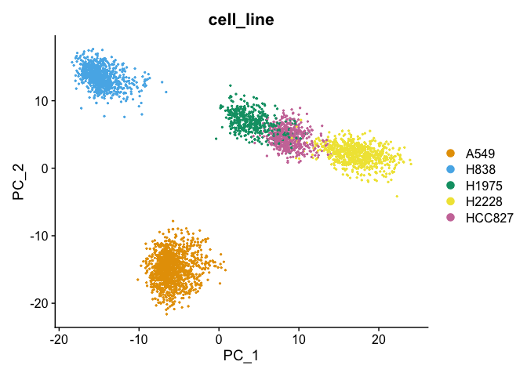
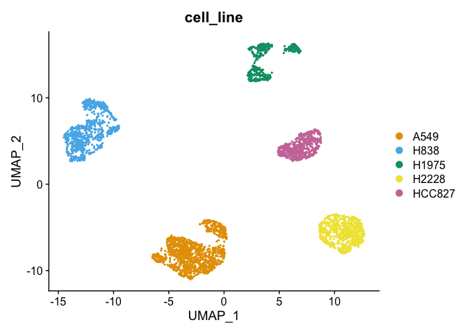
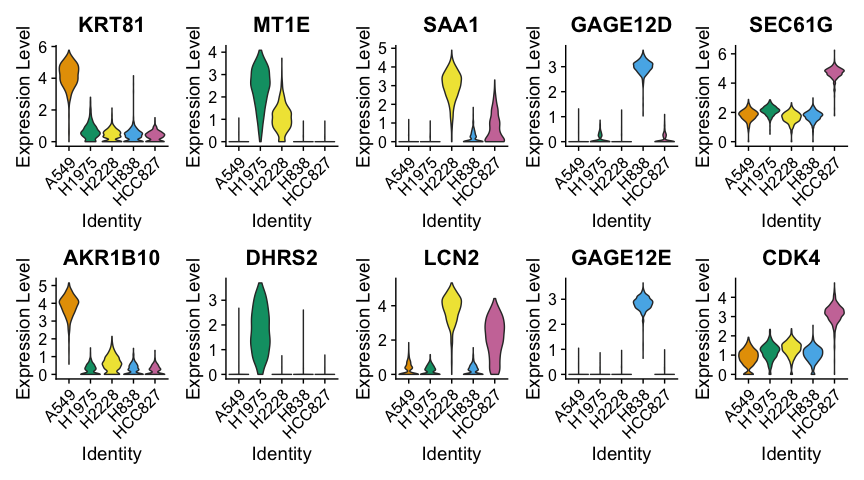
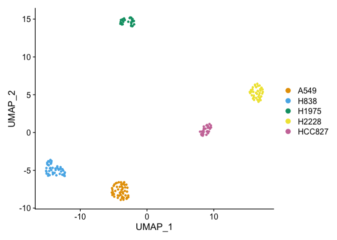
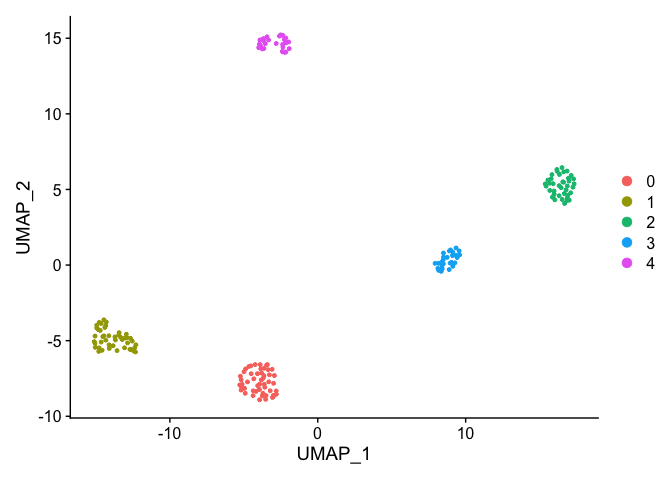
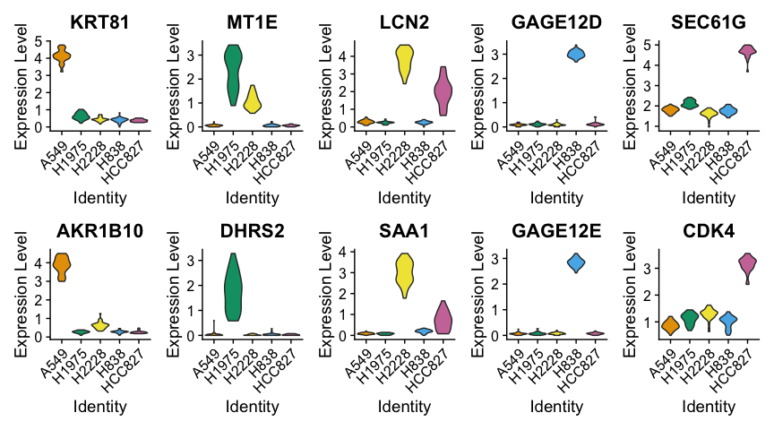
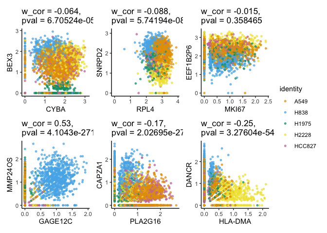
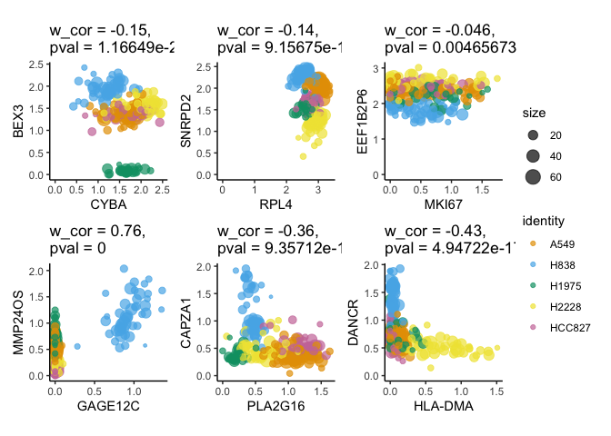
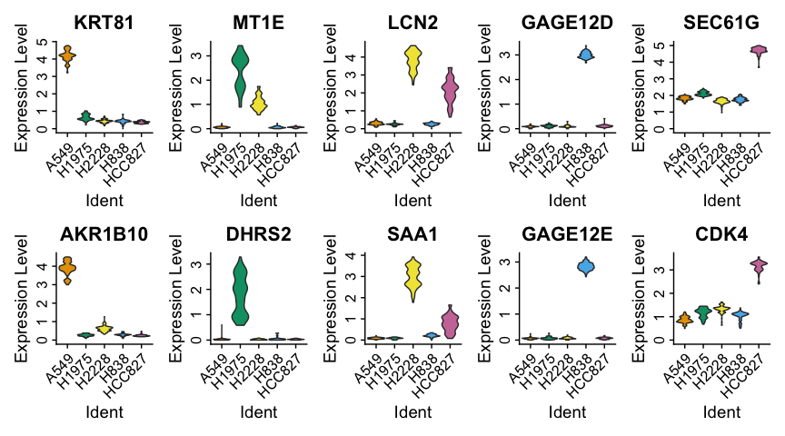

-   [Simplification of a simple scRNA-seq dataset of 5 cancer cell lines
    from Tian et al.,
    2019](#simplification-of-a-simple-scrna-seq-dataset-of-5-cancer-cell-lines-from-tian-et-al.-2019)
-   [Workbook structure](#workbook-structure)
-   [Single-cell level](#single-cell-level)
    -   [Standard downstream analysis](#standard-downstream-analysis)
        -   [Pre-processing](#pre-processing)
        -   [UMAP (non-linear dimensionality
            reduction)](#umap-non-linear-dimensionality-reduction)
        -   [Clustering](#clustering)
        -   [Differential expression
            analysis](#differential-expression-analysis)
-   [Data simplification (coarse-graining) – Construction of
    *metacells*](#data-simplification-coarse-graining-construction-of-metacells)
    -   [Analysis of *metacells*](#analysis-of-metacells)
        -   [Pre-processing](#pre-processing-1)
    -   [Standard downstream analysis of
        *metacells*](#standard-downstream-analysis-of-metacells)
        -   [Create Seurat object to perform standard downstream
            analysis](#create-seurat-object-to-perform-standard-downstream-analysis)
        -   [Clustering](#clustering-1)
        -   [DEA of cell lines in
            *metacells*](#dea-of-cell-lines-in-metacells)
        -   [Plot gene-gene correlation at single-cell and metacell
            levels](#plot-gene-gene-correlation-at-single-cell-and-metacell-levels-to-find-better-examples)
    -   [Alternative or Sample-weighted downstream analysis of
        *metacells*](#alternative-or-sample-weighted-downstream-analysis-of-metacells)
        -   [Dimensionality reduction](#dimensionality-reduction)
        -   [Clustering (sample-weighted
            hclust)](#clustering-sample-weighted-hclust)
        -   [Differential expression analysis in metacells
            (sample-weighted
            t-test)](#differential-expression-analysis-in-metacells-sample-weighted-t-test)
-   [Alternative constructions of
    metacells](#alternative-constructions-of-metacells)
    -   [Metacell construction with
        Metacell-2](#metacell-construction-with-metacell-2)
    -   [Metacell construction with
        SEACells](#metacell-construction-with-seacells)

# Simplification of a simple scRNA-seq dataset of 5 cancer cell lines from [Tian et al., 2019](https://doi.org/10.1038/s41592-019-0425-8)

# Workbook structure

We first run a **standard scRNA-seq data analysis pipeline** (i.e., data
normalization, feature selection, dimensionality reduction,
visualization, clustering and differential expression analysis) using
the [Seurat](https://satijalab.org/seurat/index.html) framework. Then,
we **simplify** the same dataset by computing *metacells* (i.e.,
grouping transcriptionally highly similar single cells into metacells).
For this, we will use a method developed in our group called
[SuperCell](https://github.com/GfellerLab/SuperCell). We then perform
the same **standard downstream analysis** of *metacells* and compare the
results to those obtained at the single-cell level. Additionally, we
provide code to run sample-weighted downstream analysis that accounts
for the metacells size.

We also provide some scripts to build *metacells* using alternative
approaches including
[Metacell-2](https://metacells.readthedocs.io/en/latest/readme.html)
([script to build metacells with
Metacell-2](https://github.com/GfellerLab/SIB_workshop/blob/main/workbooks/Notebook_1_1__MetaCell2.ipynb))
and [SEACell](https://github.com/dpeerlab/SEACells) ([script to build
metacells with
SEACells](https://github.com/GfellerLab/SIB_workshop/blob/main/workbooks/Notebook_1_2__SEACells.ipynb)).
To avoid any issues related to the installation of those packages or
data transferring from Python to R, we also provide precomputed results
of metacell partition using those two methods (see and )

    remotes::install_github("GfellerLab/SuperCell", force = TRUE, upgrade = FALSE)

    ##      checking for file ‘/private/var/folders/g3/m1nhnz5910s9mckg3ymbz_b80000gn/T/RtmpfJCuiA/remotes1e8750ac6138/GfellerLab-SuperCell-6b3581b/DESCRIPTION’ ...  ✔  checking for file ‘/private/var/folders/g3/m1nhnz5910s9mckg3ymbz_b80000gn/T/RtmpfJCuiA/remotes1e8750ac6138/GfellerLab-SuperCell-6b3581b/DESCRIPTION’
    ##   ─  preparing ‘SuperCell’:
    ##      checking DESCRIPTION meta-information ...  ✔  checking DESCRIPTION meta-information
    ##   ─  excluding invalid files
    ##      Subdirectory 'R' contains invalid file names:
    ##      ‘test_GE.Rmd’
    ##   ─  checking for LF line-endings in source and make files and shell scripts
    ##   ─  checking for empty or unneeded directories
    ##        NB: this package now depends on R (>= 3.5.0)
    ##        WARNING: Added dependency on R >= 3.5.0 because serialized objects in  serialize/load version 3 cannot be read in older versions of R.  File(s) containing such objects:  ‘SuperCell/data/5cancer_cell_lines_10x_cell_line_assignment.Rds’  WARNING: Added dependency on R >= 3.5.0 because serialized objects in  serialize/load version 3 cannot be read in older versions of R.  File(s) containing such objects:  ‘SuperCell/data/5cancer_cell_lines_10x_GE.Rds’  WARNING: Added dependency on R >= 3.5.0 because serialized objects in  serialize/load version 3 cannot be read in older versions of R.  File(s) containing such objects: ‘SuperCell/data/cell_lines.RData’
    ##   ─  building ‘SuperCell_1.0.tar.gz’
    ##      Warning in utils::tar(filepath, pkgname, compression = compression, compression_level = 9L,  :
    ##      storing paths of more than 100 bytes is not portable:
    ##      ‘SuperCell/workbooks/Combined_vs_independent_sample_processing_files/figure-markdown_github/unnamed-chunk-1-1.png’
    ##      Warning in utils::tar(filepath, pkgname, compression = compression, compression_level = 9L,  :
    ##      storing paths of more than 100 bytes is not portable:
    ##      ‘SuperCell/workbooks/Combined_vs_independent_sample_processing_files/figure-markdown_github/unnamed-chunk-2-1.png’
    ##      Warning in utils::tar(filepath, pkgname, compression = compression, compression_level = 9L,  :
    ##      storing paths of more than 100 bytes is not portable:
    ##      ‘SuperCell/workbooks/Combined_vs_independent_sample_processing_files/figure-markdown_github/unnamed-chunk-3-1.png’
    ##      
    ## 

    library(SuperCell)
    library(Seurat)
    library(dplyr)

    proj.name    <- 'cell_lines'
    .color.cell.type <- c("A549" = "#E69F00", "H838" = "#56B4E9", "H1975" = "#009E73", "H2228" = "#F0E442", "HCC827" = "#CC79A7")
    data.folder  <- file.path("..", "data", proj.name)

    # load single-cell (sc) count matrix and cell metadata 
    sc.counts <- readRDS(file.path(data.folder, "sc_counts_filtered.Rds"))
    sc.meta   <- readRDS(file.path(data.folder, "sc_meta_filtered.Rds"))

    # Make sure metadata and count matrix have the same cells in the same order
    if(!identical(rownames(sc.meta), colnames(sc.counts))){
      stop("Metadata (`sc.meta`) does not correspond to the count matrix (`sc.counts`)")
    }

# Single-cell level

## Standard downstream analysis

Run a brief analysis at the single-cell level, let’s use the common
[Seurat](https://satijalab.org/seurat/index.html) pipeline.

    set.seed(12345)
    sc <- CreateSeuratObject(counts = sc.counts, project = proj.name, meta.data = sc.meta)
    sc

    ## An object of class Seurat 
    ## 11786 features across 3822 samples within 1 assay 
    ## Active assay: RNA (11786 features, 0 variable features)

### Pre-processing

*Note*: It is more step-by-step pre-processing, that can be replaced
with one-line command:
`sc <-  NormalizeData(sc, verbose=FALSE) %>% FindVariableFeatures(selection.method = "disp", nfeatures = 1000, verbose=FALSE) %>% ScaleData(verbose=FALSE) %>% RunPCA(verbose=FALSE)`

#### Data normalization

    sc <- NormalizeData(sc, verbose=FALSE)

    sc <- FindVariableFeatures(
      sc, 
      selection.method = "disp", # "vst" is default
      nfeatures = 1000,
      verbose=FALSE
      )

    hvg <- VariableFeatures(sc, verbose=FALSE)

    # Plot variable features 
    plot1 <- VariableFeaturePlot(sc)
    LabelPoints(plot = plot1, points = hvg[1:20], repel = TRUE)

#### Scaling and dimensionality redution

    sc <- ScaleData(sc, verbose=FALSE)
    sc <- RunPCA(sc, verbose=FALSE)

    # Plot PCA (2D representation of scRNA-seq data) colored by cell line
    DimPlot(sc, reduction = "pca", group.by = "cell_line", cols = .color.cell.type)

### UMAP (non-linear dimensionality reduction)

    sc <- RunUMAP(sc,  dims = 1:10)

    # Plot UMAP (2D representation of scRNA-seq data) colored by cell line
    DimPlot(sc, reduction = "umap", group.by = "cell_line", cols = .color.cell.type)

### Clustering

    sc <- FindNeighbors(sc, dims = 1:10)
    sc <- FindClusters(sc, resolution = 0.05)

    ## Modularity Optimizer version 1.3.0 by Ludo Waltman and Nees Jan van Eck
    ## 
    ## Number of nodes: 3822
    ## Number of edges: 121361
    ## 
    ## Running Louvain algorithm...
    ## Maximum modularity in 10 random starts: 0.9890
    ## Number of communities: 5
    ## Elapsed time: 0 seconds

    # As it is a toy example with well defined cell types (i.e., cell lines), unsupervised clustering fully recapitulates cell line annotation 
    table(sc@active.ident, sc$cell_line)

    ##    
    ##     A549 H1975 H2228 H838 HCC827
    ##   0 1237     0     0    0      0
    ##   1    0     0     0  841      0
    ##   2    0     0   744    0      0
    ##   3    0     0     0    0    571
    ##   4    0   429     0    0      0

    DimPlot(sc, reduction = "umap", group.by = "ident")

### Differential expression analysis

#### Find Markers of cell lines

    # Set idents to cell lines (as clusters are the same as cell lines)
    Idents(sc) <- "cell_line" 
    levels(sc) <- sort(levels(sc))

    # Compute upregulated genes in each cell line (versus other cells)
    sc.all.markers <-  FindAllMarkers(sc, only.pos = TRUE, min.pct = 0.25, logfc.threshold = 0.25, test.use = "t")
    saveRDS(sc.all.markers, file = file.path(data.folder, "output", "sc_all_markers.Rds"))

    # Load markers (backup)
    #sc.all.markers <- readRDS(file = file.path(data.folder, "output", "sc_all_markers.Rds"))

    # Top markers (select top markers of each cell line)
    sc.top.markers <- sc.all.markers %>%
       group_by(cluster) %>%
        slice_max(n = 2, order_by = avg_log2FC)

    sc.top.markers

    ## # A tibble: 10 × 7
    ## # Groups:   cluster [5]
    ##        p_val avg_log2FC pct.1 pct.2 p_val_adj cluster gene   
    ##        <dbl>      <dbl> <dbl> <dbl>     <dbl> <fct>   <chr>  
    ##  1 0               5.56 0.998 0.775 0         A549    KRT81  
    ##  2 0               5.15 1     0.675 0         A549    AKR1B10
    ##  3 1.05e-180       3.26 0.991 0.323 1.24e-176 H1975   MT1E   
    ##  4 1.42e-142       3.07 0.963 0.083 1.68e-138 H1975   DHRS2  
    ##  5 0               4.08 0.997 0.371 0         H2228   SAA1   
    ##  6 0               3.94 0.999 0.625 0         H2228   LCN2   
    ##  7 0               4.20 1     0.245 0         H838    GAGE12D
    ##  8 0               4.01 1     0.176 0         H838    GAGE12E
    ##  9 0               4.17 1     0.996 0         HCC827  SEC61G 
    ## 10 0               3.05 0.998 0.941 0         HCC827  CDK4

#### Plot the expression of some markers

    VlnPlot(sc, features = sc.top.markers$gene[c(seq(1, 9, 2), seq(2, 10, 2))], ncol = 5, pt.size = 0.0, cols = .color.cell.type)

# Data simplification (coarse-graining) – Construction of *metacells*

Here we compute metacells using our method called
[SuperCell](https://github.com/GfellerLab/SuperCell), but equally,
metacells can be computed with
[Metacell](https://github.com/tanaylab/metacell),
[Metacell-2](https://metacells.readthedocs.io/en/latest/readme.html) or
[SEACell](https://github.com/dpeerlab/SEACells) algorithms and we will
see some examples below.

    gamma <- 20 # Graining level

    # Compute metacells using SuperCell package
    MC <- SCimplify(
      X = GetAssayData(sc), # single-cell log-normalized gene expression data
      genes.use = hvg, 
      gamma = gamma,
      n.pc = 10
    )

    # Compute gene expression of metacells by simply averaging gene expression within each metacell
    MC.ge <- supercell_GE(
      ge = GetAssayData(sc),
      groups = MC$membership
    )

    # Alternatively, counts can be averaged (summed up) followed by a lognormalization step (this approach is used in the MetaCell and SEACell algorithms)
    if(0){
      MC.counts <- supercell_GE(
        ge = GetAssayData(sc, slot = "counts"),
        mode = "sum", # summing counts instead of the default averaging
        groups = MC$membership
      )
      
      MC.ge <- Seurat::LogNormalize(MC.counts, verbose = FALSE)
    }

## Analysis of *metacells*

### Pre-processing

#### Transfer metadata (annotate metacell to a certain cell line)

Since the cell line information is available in this dataset, we can
annotate metacells to a certain cell line. Each metacell is annotated to
the most abundant cell type in it. This also allows us to compute
metacell *purity*, that is defined as a proportion of the most abundant
cell type (use `method = "max_proportion"`) or as Shannon entropy (use
`method = "entropy"`).

    # Annotate metacells to cells line
    MC$cell_line <- supercell_assign(
      cluster = sc.meta$cell_line,          # single-cell assignment to cell lines 
      supercell_membership = MC$membership,  # single-cell assignment to metacells
      method = "absolute" # available methods are c("jaccard", "relative", "absolute"), function's help() for explanation
    )

    # Compute purity of metacells as :
    #  * a proportion of the most abundant cell type withing metacells (`method = `"max_proportion)
    #  * an entropy of cell type within metacells (`method = "entropy"`)
    method_purity <- c("max_proportion", "entropy")[1]
    MC$purity <- supercell_purity(
      clusters = sc.meta$cell_line,
      supercell_membership = MC$membership, 
      method = method_purity
    )

    # Metacell purity distribution
    summary(MC$purity)

    ##    Min. 1st Qu.  Median    Mean 3rd Qu.    Max. 
    ##       1       1       1       1       1       1

    hist(MC$purity, main = paste0("Purity of metacells \nin terms of cell line composition (", method_purity,")"))

#### Visualize data using metacell and single-cell networks

    supercell_plot(
      MC$graph.supercells, 
      group = MC$cell_line, 
      color.use = .color.cell.type,
      seed = 1, 
      alpha = -pi/2,
      main  = "Metacells colored by cell line assignment"
    )

    supercell_plot(
      MC$graph.singlecell, 
      group = sc.meta$cell_line, 
      color.use = .color.cell.type,
      do.frames = FALSE,
      lay.method = "components",
      seed = 1, 
      alpha = -pi/2,
      main  = "Single cells colored by cell line assignment"
    )

There are two options to perform the downstream analysis:

-   **standard** when we treat metacells as single-cell data and apply a
    standard pipeline
-   **sample-weighted** when we account for a metacell size at each step
    of the analysis

## Standard downstream analysis of *metacells*

For the standard downstream analysis, we can use the well-established
[Seurat](https://satijalab.org/seurat/index.html) pipeline

### Create Seurat object to perform standard downstream analysis

*Note*: When creating Seurat Object, we perform sample-weighted scaling
of gene expression data and sample-weighted PCA (with the weigh being
the metacell size).

    MC.seurat <- supercell_2_Seurat(
      SC.GE = MC.ge, 
      SC = MC, 
      fields = c("cell_line", "purity"),
      var.genes = MC$genes.use,
      N.comp = 10
    )

    ## [1] "Done: NormalizeData"
    ## [1] "Doing: data to normalized data"
    ## [1] "Doing: weighted scaling"
    ## [1] "Done: weighted scaling"

    Idents(MC.seurat) <- "cell_line"

    MC.seurat <- RunUMAP(MC.seurat, dims = 1:10)

    ## 19:46:08 UMAP embedding parameters a = 0.9922 b = 1.112

    ## 19:46:08 Read 191 rows and found 10 numeric columns

    ## 19:46:08 Using Annoy for neighbor search, n_neighbors = 30

    ## 19:46:08 Building Annoy index with metric = cosine, n_trees = 50

    ## 0%   10   20   30   40   50   60   70   80   90   100%

    ## [----|----|----|----|----|----|----|----|----|----|

    ## **************************************************|
    ## 19:46:08 Writing NN index file to temp file /var/folders/g3/m1nhnz5910s9mckg3ymbz_b80000gn/T//RtmpfJCuiA/file1e874ac9b766
    ## 19:46:08 Searching Annoy index using 1 thread, search_k = 3000
    ## 19:46:08 Annoy recall = 100%
    ## 19:46:08 Commencing smooth kNN distance calibration using 1 thread
    ## 19:46:09 Found 2 connected components, falling back to 'spca' initialization with init_sdev = 1
    ## 19:46:09 Initializing from PCA
    ## 19:46:09 Using 'irlba' for PCA
    ## 19:46:09 PCA: 2 components explained 49.92% variance
    ## 19:46:09 Commencing optimization for 500 epochs, with 6042 positive edges
    ## 19:46:09 Optimization finished

    DimPlot(MC.seurat, cols = .color.cell.type, reduction = "umap")

### Clustering

Seurat clustering

    MC.seurat <- FindClusters(MC.seurat, resolution = 0.5)

    ## Modularity Optimizer version 1.3.0 by Ludo Waltman and Nees Jan van Eck
    ## 
    ## Number of nodes: 191
    ## Number of edges: 3703
    ## 
    ## Running Louvain algorithm...
    ## Maximum modularity in 10 random starts: 0.8899
    ## Number of communities: 5
    ## Elapsed time: 0 seconds

    DimPlot(MC.seurat, reduction = "umap")

### DEA of cell lines in *metacells*

#### Find Markers of cell lines

    # Set idents to cell lines (as clusters are the same as cell lines)
    Idents(MC.seurat) <- "cell_line"
    levels(MC.seurat) <- sort(levels(Idents(MC.seurat)))

    # Compute upregulated genes in each cell line (versus other cells)
    MC.seurat.all.markers <-  FindAllMarkers(
      MC.seurat, 
      only.pos = TRUE,
      min.pct = 0.25, 
      logfc.threshold = 0.25, 
      test.use = "t"
    )
    saveRDS(MC.seurat.all.markers, file = file.path(data.folder, "output", paste0("MC_gamma_", gamma, "_all_markers_seurat.Rds")))

    # Load markers (backup)
    #MC.seurat.all.markers <- readRDS(file = file.path(data.folder, "output", "MC_gamma_20_all_markers_seurat.Rds"))

    # Top markers (select top markers of each cell line)
    MC.seurat.top.markers <- MC.seurat.all.markers %>%
       group_by(cluster) %>%
        slice_max(n = 2, order_by = avg_log2FC)

    MC.seurat.top.markers

    ## # A tibble: 10 × 7
    ## # Groups:   cluster [5]
    ##       p_val avg_log2FC pct.1 pct.2 p_val_adj cluster gene   
    ##       <dbl>      <dbl> <dbl> <dbl>     <dbl> <fct>   <chr>  
    ##  1 2.08e-57       5.37     1 0.993  2.45e-53 A549    KRT81  
    ##  2 1.03e-51       5.12     1 1      1.21e-47 A549    AKR1B10
    ##  3 1.89e-14       3.12     1 0.89   2.23e-10 H1975   MT1E   
    ##  4 5.18e-12       2.84     1 0.695  6.11e- 8 H1975   DHRS2  
    ##  5 9.90e-43       4.19     1 0.993  1.17e-38 H2228   LCN2   
    ##  6 1.08e-32       4.09     1 0.954  1.28e-28 H2228   SAA1   
    ##  7 2.11e-63       4.21     1 0.911  2.49e-59 H838    GAGE12D
    ##  8 1.24e-57       4.01     1 0.911  1.47e-53 H838    GAGE12E
    ##  9 2.48e-34       4.13     1 1      2.92e-30 HCC827  SEC61G 
    ## 10 5.92e-30       3.02     1 1      6.98e-26 HCC827  CDK4

#### Plot the expression of some markers

    genes.to.plot <- MC.seurat.top.markers$gene[c(seq(1, 9, 2), seq(2, 10, 2))]
    VlnPlot(MC.seurat, features = genes.to.plot, ncol = 5, pt.size = 0.0, cols = .color.cell.type)

### Plot gene-gene correlation at single-cell and metacell levels (! TO find better examples)

    gene_x <- MC$genes.use[500:505] #500
    gene_y <- MC$genes.use[550:555] #600

    alpha <- 0.7

    p.SC <- supercell_GeneGenePlot(GetAssayData(sc, slot = "data"), gene_x = gene_x, gene_y = gene_y, clusters = sc$cell_line, color.use = .color.cell.type, sort.by.corr = F, alpha = alpha)
    p.SC$p

    p.MC <- supercell_GeneGenePlot(MC.ge, gene_x = gene_x, gene_y = gene_y, supercell_size = MC$supercell_size, clusters = MC$cell_line, color.use = .color.cell.type, sort.by.corr = F, alpha = alpha)
    p.MC$p

## Alternative or Sample-weighted downstream analysis of *metacells*

For the sample-weighted analysis, we use a pipeline available with our
[SuperCell](https://github.com/GfellerLab/SuperCell) package.

### Dimensionality reduction

    MC$PCA <- supercell_prcomp(
      Matrix::t(MC.ge),
      genes.use = MC$genes.use,  # or a new set of HVG can be computed
      supercell_size = MC$supercell_size, # provide this parameter to run sample-weighted version of PCA,
      k = 10
    )

    MC$UMAP <- supercell_UMAP(
      SC = MC,
      PCA_name = "PCA",
      n_neighbors = 50 # large number to repel cells 
    )

    supercell_DimPlot(
      MC, 
      groups = MC$cell_line,
      dim.name = "UMAP", 
      title = paste0("UMAP of metacells colored by cell line assignment"),
      color.use = .color.cell.type
    )

### Clustering (sample-weighted hclust)

Sample-weighted clustering computed with the hierarchical clustering,
that may accounts for sample weights

    # compute distance among metacells
    D                <- dist(MC$PCA$x)

    # cluster metacells
    MC$clustering    <- supercell_cluster(D = D, k = 5, supercell_size = MC$supercell_size)

    # Plot clustering result
    supercell_DimPlot(
      MC, 
      groups = factor(MC$clustering$clustering),
      dim.name = "UMAP", 
      title = paste0("UMAP of metacells colored by metacell clustering")
    )

    table(MC$cell_line, MC$clustering$clustering)

    ##         
    ##           1  2  3  4  5
    ##   A549   51  0  0  0  0
    ##   H1975   0  0  0  0 27
    ##   H2228   0  0 40  0  0
    ##   H838    0  0  0 45  0
    ##   HCC827  0 28  0  0  0

### Differential expression analysis in metacells (sample-weighted t-test)

    # Compute upregulated genes in each cell line (versus other cells)
    MC.all.markers <- supercell_FindAllMarkers(
      ge = MC.ge, 
      clusters = MC$cell_line, 
      supercell_size = MC$supercell_size,
      only.pos = TRUE, 
      min.pct = 0.25, 
      logfc.threshold = 0.25
    )

    saveRDS(MC.all.markers, file = file.path(data.folder, "output",  paste0("MC_gamma_", gamma, "_all_markers.Rds")))

    # Load markers (backup)
    #MC.all.markers <- readRDS(file = file.path(data.folder, "output", "paste0("MC_gamma_", gamma, "_all_markers.Rds")))

    # Transform the output of `supercell_FindAllMarkers()` to be in the format of the `Seurat::FindAllMarkers()`
    MC.all.markers.df <- data.frame()
    for(cl in names(MC.all.markers)){
      cur <- MC.all.markers[[cl]]
      cur$cluster <- cl
      cur$gene <- rownames(cur)
      cur$avg_log2FC <- cur$logFC
      MC.all.markers.df <- rbind(MC.all.markers.df, cur)
    }

    # Top markers (select top markers of each cell line)
    MC.top.markers <- MC.all.markers.df %>%
       group_by(cluster) %>%
        slice_max(n = 2, order_by = avg_log2FC)

#### Plot the expression of some markers (in metacells)

    supercell_VlnPlot(
      ge = MC.ge, 
      supercell_size = MC$supercell_size, 
      clusters = MC$cell_line,
      features = MC.top.markers$gene[c(seq(1, 9, 2), seq(2, 10, 2))],
      color.use = .color.cell.type,
      ncol = 5)

# Alternative constructions of metacells

## Metacell construction with [Metacell-2](https://metacells.readthedocs.io/en/latest/Metacells_Vignette.html)

Metacell concept is not limited to the SuperCell algorithm and metacells
can be computed using the
[Metacell-2](https://metacells.readthedocs.io/en/latest/Metacells_Vignette.html)
and [SEACells](https://github.com/dpeerlab/SEACells) algorithms. Since
both of the methods are implemented in Python, we provide scripts to
build metacells of the same cell line dataset either with
[Metacell-2](https://github.com/GfellerLab/SIB_workshop/blob/main/workbooks/Notebook_1_1__MetaCell2.ipynb)
or with
[SEACells](https://github.com/GfellerLab/SIB_workshop/blob/main/workbooks/Notebook_1_2__SEACells.ipynb).
In the following sections you can find 2 examples of how to use the
output of those algorithms to obtain SuperCell-like output, which you
can use for the downstream analysis as was demonstrated above.

Load pre-computed metacells with the Metacell-2 approach. See this
[workbook](https://github.com/GfellerLab/SIB_workshop/blob/main/workbooks/Notebook_1_1__MetaCell2.ipynb)
to reproduce the results or to run your own Metacell-2 construction.

**Note**, that to read python output, you will need the
[anndata](https://cran.r-project.org/web/packages/anndata/index.html)
library that may need some effort to install correctly. In case you
faced any difficulties reading .h5ad anndata object (file
`"seacells_gamma_20.h5ad"`), you can load the converted to the
SuperCell-like .Rds object (file `"seacells_gamma_20.Rdata"`) or Seurat
object (file `"seacells_gamma_20_seurat.Rds"`)

    I_HAVE_ANNDATA_PACKAGE <- TRUE # Replace with FALSE if you have any issues reading .h5ad files
    fname <- "metacell2_gamma_20"

    if(I_HAVE_ANNDATA_PACKAGE){
      library(anndata)
      ## Load pre-computed metacell partition obtained with Metacell-2 (anndata)
      
      ## comment this and provide R object directly in case anndata rises errors 
      metacell2_adata  <- read_h5ad(file.path(data.folder, "output", paste0(fname, ".h5ad"))) # Metacell as anndata object
      obs.sc           <- metacell2_adata$uns$sc.obs # obs (cell meta data) of single-cell data used to build metacells with Metacell2
      
      metacell2        <- anndata_2_supercell(metacell2_adata) 
      
      ## Annotate metacells to cell lines
      metacell2$SC_cell_line <- supercell_assign(
        sc.meta$cell_line, 
        supercell_membership = metacell2$membership
      )
      
      ## Convert to Seurat object
      metacell2.seurat <- supercell_2_Seurat(
        SC.GE = metacell2$SC.counts, 
        is.log.normalized = FALSE, # Note, that we provided count matrix in contrast to the SuperCell output
        SC = metacell2, 
        fields = c("SC_cell_line", "supercell_size")
      )
      
      ## Add metadata that we stored 
      metacell2.seurat <- AddMetaData(metacell2.seurat, metadata = metacell2$SC.meta)
      Idents(metacell2.seurat) <- "SC_cell_line"
      levels(metacell2.seurat) <- sort(levels(metacell2.seurat))
      
      saveRDS(metacell2, file = file.path(data.folder, "output", paste0(fname, ".Rds")))
      saveRDS(metacell2.seurat, file = file.path(data.folder, "output", paste0(fname, "_seurat.Rds")))
      
    } else {
      metacell2        <- readRDS(file = file.path(data.folder, "output", paste0(fname, ".Rds")))
      metacell2.seurat <- readRDS(file = file.path(data.folder, "output", paste0(fname, "_seurat.Rds")))
    }

    ## [1] "Done: NormalizeData"
    ## [1] "Doing: weighted scaling"
    ## [1] "Done: weighted scaling"

    ## Warning in supercell_2_Seurat(SC.GE = metacell2$SC.counts, is.log.normalized =
    ## FALSE, : Super-cell graph was not found in SC object, no super-cell graph was
    ## added to Seurat object

## Metacell construction with [SEACells](https://github.com/dpeerlab/SEACells)

Load pre-computed metacells with the SEACells approach. See this
[workbook](https://github.com/GfellerLab/SIB_workshop/blob/main/workbooks/Notebook_1_2__SEACells.ipynb)
to reproduce the results or to run your own SEACells construction.

    I_HAVE_ANNDATA_PACKAGE <- TRUE
    fname <- "seacells_gamma_20"

    if(I_HAVE_ANNDATA_PACKAGE){
      library(anndata)
      ## Load pre-computed metacell partition obtained with SEACells (anndata)
      
      ## comment this and provide R object directly in case anndata will rise errors 
      seacell_adata    <- read_h5ad(file.path(data.folder, "output", paste0(fname, ".h5ad"))) # SEACells as anndata object
      obs.sc           <- seacell_adata$uns$sc.obs # obs (cell meta data) of single-cell data used to build metacells with SEACells
      
      seacell          <- anndata_2_supercell(seacell_adata) 
      
      ## Annotate metacells to cell lines
      seacell$SC_cell_line <- supercell_assign(
        sc.meta$cell_line, 
        supercell_membership = seacell$membership
      )
      
      ## Convert to Seurat object
      seacell.seurat <- supercell_2_Seurat(
        SC.GE = seacell$SC.counts, 
        is.log.normalized = FALSE, # Note, that we provided count matrix in contrast to the SuperCell output
        SC = seacell, 
        fields = c("SC_cell_line", "supercell_size")
      )
      
      Idents(seacell.seurat) <- "SC_cell_line"
      levels(seacell.seurat) <- sort(levels(seacell.seurat))
      
      saveRDS(seacell, file = file.path(data.folder, "output", paste0(fname, ".Rds")))
      saveRDS(seacell.seurat, file = file.path(data.folder, "output", paste0(fname, "_seurat.Rds")))
      
    } else {
      seacell        <- readRDS(file = file.path(data.folder, "output", paste0(fname, ".Rds")))
      seacell.seurat <- readRDS(file = file.path(data.folder, "output", paste0(fname, "_seurat.Rds")))
    }

    ## [1] "Done: NormalizeData"
    ## [1] "Doing: weighted scaling"
    ## [1] "Done: weighted scaling"

    ## Warning in supercell_2_Seurat(SC.GE = seacell$SC.counts, is.log.normalized =
    ## FALSE, : Super-cell graph was not found in SC object, no super-cell graph was
    ## added to Seurat object

 Current session info 

    ─ Session info ───────────────────────────────────────────────────────────────
     setting  value                       
     version  R version 4.0.4 (2021-02-15)
     os       macOS Mojave 10.14.6        
     system   x86_64, darwin17.0          
     ui       X11                         
     language (EN)                        
     collate  en_US.UTF-8                 
     ctype    en_US.UTF-8                 
     tz       Europe/Zurich               
     date     2022-06-09                  

    ─ Packages ───────────────────────────────────────────────────────────────────
     package         * version  date       lib
     abind             1.4-5    2016-07-21 [1]
     anndata         * 0.7.5.3  2021-09-10 [1]
     askpass           1.1      2019-01-13 [1]
     assertthat        0.2.1    2019-03-21 [1]
     backports         1.4.1    2021-12-13 [1]
     base64enc         0.1-3    2015-07-28 [1]
     boot              1.3-27   2021-02-12 [1]
     broom             0.8.0    2022-04-13 [1]
     callr             3.7.0    2021-04-20 [1]
     checkmate         2.1.0    2022-04-21 [1]
     cli               3.3.0    2022-04-25 [1]
     clipr             0.7.1    2020-10-08 [1]
     cluster           2.1.1    2021-02-14 [1]
     codetools         0.2-18   2020-11-04 [1]
     colorspace        2.0-3    2022-02-21 [1]
     corpcor           1.6.10   2021-09-16 [1]
     cowplot           1.1.1    2020-12-30 [1]
     crayon            1.5.1    2022-03-26 [1]
     curl              4.3.2    2021-06-23 [1]
     data.table        1.14.2   2021-09-27 [1]
     DBI               1.1.1    2021-01-15 [1]
     deldir            1.0-6    2021-10-23 [1]
     desc              1.4.1    2022-03-06 [1]
     details           0.3.0    2022-03-27 [1]
     digest            0.6.29   2021-12-01 [1]
     dplyr           * 1.0.9    2022-04-28 [1]
     ellipsis          0.3.2    2021-04-29 [1]
     evaluate          0.15     2022-02-18 [1]
     fansi             1.0.3    2022-03-24 [1]
     farver            2.1.0    2021-02-28 [1]
     fastmap           1.1.0    2021-01-25 [1]
     fitdistrplus      1.1-8    2022-03-10 [1]
     foreign           0.8-81   2020-12-22 [1]
     Formula           1.2-4    2020-10-16 [1]
     future            1.25.0   2022-04-24 [1]
     future.apply      1.9.0    2022-04-25 [1]
     gdata             2.18.0.1 2022-05-10 [1]
     generics          0.1.2    2022-01-31 [1]
     ggplot2           3.3.6    2022-05-03 [1]
     ggrepel           0.9.1    2021-01-15 [1]
     ggridges          0.5.3    2021-01-08 [1]
     globals           0.15.0   2022-05-09 [1]
     glue              1.6.2    2022-02-24 [1]
     goftest           1.2-3    2021-10-07 [1]
     gridExtra         2.3      2017-09-09 [1]
     gtable            0.3.0    2019-03-25 [1]
     gtools            3.9.2    2021-06-06 [1]
     highr             0.9      2021-04-16 [1]
     Hmisc             4.7-0    2022-04-19 [1]
     htmlTable         2.4.0    2022-01-04 [1]
     htmltools         0.5.2    2021-08-25 [1]
     htmlwidgets       1.5.4    2021-09-08 [1]
     httpuv            1.6.5    2022-01-05 [1]
     httr              1.4.3    2022-05-04 [1]
     ica               1.0-2    2018-05-24 [1]
     igraph            1.3.1    2022-04-20 [1]
     irlba             2.3.5    2021-12-06 [1]
     jpeg              0.1-9    2021-07-24 [1]
     jsonlite          1.8.0    2022-02-22 [1]
     KernSmooth        2.23-18  2020-10-29 [1]
     knitr             1.39     2022-04-26 [1]
     labeling          0.4.2    2020-10-20 [1]
     later             1.3.0    2021-08-18 [1]
     lattice           0.20-41  2020-04-02 [1]
     latticeExtra      0.6-29   2019-12-19 [1]
     lazyeval          0.2.2    2019-03-15 [1]
     leiden            0.4.2    2022-05-09 [1]
     lifecycle         1.0.1    2021-09-24 [1]
     listenv           0.8.0    2019-12-05 [1]
     lme4              1.1-29   2022-04-07 [1]
     lmtest            0.9-40   2022-03-21 [1]
     magrittr          2.0.3    2022-03-30 [1]
     MASS              7.3-53.1 2021-02-12 [1]
     Matrix            1.4-1    2022-03-23 [1]
     matrixStats       0.62.0   2022-04-19 [1]
     mgcv              1.8-34   2021-02-16 [1]
     mice              3.14.0   2021-11-24 [1]
     mime              0.12     2021-09-28 [1]
     miniUI            0.1.1.1  2018-05-18 [1]
     minqa             1.2.4    2014-10-09 [1]
     munsell           0.5.0    2018-06-12 [1]
     nlme              3.1-152  2021-02-04 [1]
     nloptr            2.0.0    2022-01-26 [1]
     nnet              7.3-15   2021-01-24 [1]
     openssl           2.0.0    2022-03-02 [1]
     parallelly        1.31.1   2022-04-22 [1]
     patchwork         1.1.1    2020-12-17 [1]
     pbapply           1.5-0    2021-09-16 [1]
     pillar            1.7.0    2022-02-01 [1]
     pkgbuild          1.2.0    2020-12-15 [1]
     pkgconfig         2.0.3    2019-09-22 [1]
     plotly            4.10.0   2021-10-09 [1]
     plyr              1.8.7    2022-03-24 [1]
     png               0.1-7    2013-12-03 [1]
     polyclip          1.10-0   2019-03-14 [1]
     prettyunits       1.1.1    2020-01-24 [1]
     processx          3.5.3    2022-03-25 [1]
     progressr         0.10.0   2021-12-19 [1]
     promises          1.2.0.1  2021-02-11 [1]
     ps                1.7.0    2022-04-23 [1]
     purrr             0.3.4    2020-04-17 [1]
     R6                2.5.1    2021-08-19 [1]
     RANN              2.6.1    2019-01-08 [1]
     RColorBrewer      1.1-3    2022-04-03 [1]
     Rcpp              1.0.8.3  2022-03-17 [1]
     RcppAnnoy         0.0.19   2021-07-30 [1]
     remotes           2.4.1    2021-09-29 [1]
     reshape2          1.4.4    2020-04-09 [1]
     reticulate        1.25     2022-05-11 [1]
     rgdal             1.5-23   2021-02-03 [1]
     rgeos             0.5-9    2021-12-15 [1]
     rlang             1.0.2    2022-03-04 [1]
     rmarkdown         2.14     2022-04-25 [1]
     ROCR              1.0-11   2020-05-02 [1]
     rpart             4.1-15   2019-04-12 [1]
     rprojroot         2.0.3    2022-04-02 [1]
     RSpectra          0.16-1   2022-04-24 [1]
     rstudioapi        0.13     2020-11-12 [1]
     Rtsne             0.16     2022-04-17 [1]
     scales            1.2.0    2022-04-13 [1]
     scattermore       0.8      2022-02-14 [1]
     sctransform       0.3.3    2022-01-13 [1]
     sessioninfo       1.1.1    2018-11-05 [1]
     Seurat          * 4.1.1    2022-05-02 [1]
     SeuratObject    * 4.1.0    2022-05-01 [1]
     shiny             1.7.1    2021-10-02 [1]
     sp              * 1.4-7    2022-04-20 [1]
     spatstat.core     2.4-2    2022-04-01 [1]
     spatstat.data     2.2-0    2022-04-18 [1]
     spatstat.geom     2.4-0    2022-03-29 [1]
     spatstat.random   2.2-0    2022-03-30 [1]
     spatstat.sparse   2.1-1    2022-04-18 [1]
     spatstat.utils    2.3-1    2022-05-06 [1]
     stringi           1.7.6    2021-11-29 [1]
     stringr           1.4.0    2019-02-10 [1]
     SuperCell       * 1.0      2022-06-09 [1]
     survival          3.2-7    2020-09-28 [1]
     tensor            1.5      2012-05-05 [1]
     tibble            3.1.7    2022-05-03 [1]
     tidyr             1.2.0    2022-02-01 [1]
     tidyselect        1.1.2    2022-02-21 [1]
     umap              0.2.7.0  2020-11-04 [1]
     utf8              1.2.2    2021-07-24 [1]
     uwot              0.1.11   2021-12-02 [1]
     vctrs             0.4.1    2022-04-13 [1]
     viridisLite       0.4.0    2021-04-13 [1]
     weights           1.0.4    2021-06-10 [1]
     withr             2.5.0    2022-03-03 [1]
     xfun              0.31     2022-05-10 [1]
     xml2              1.3.2    2020-04-23 [1]
     xtable            1.8-4    2019-04-21 [1]
     yaml              2.3.5    2022-02-21 [1]
     zoo               1.8-10   2022-04-15 [1]
     source                               
     CRAN (R 4.0.2)                       
     CRAN (R 4.0.2)                       
     CRAN (R 4.0.2)                       
     CRAN (R 4.0.2)                       
     CRAN (R 4.0.2)                       
     CRAN (R 4.0.2)                       
     CRAN (R 4.0.2)                       
     CRAN (R 4.0.4)                       
     CRAN (R 4.0.2)                       
     CRAN (R 4.0.4)                       
     CRAN (R 4.0.4)                       
     CRAN (R 4.0.2)                       
     CRAN (R 4.0.2)                       
     CRAN (R 4.0.2)                       
     CRAN (R 4.0.5)                       
     CRAN (R 4.0.2)                       
     CRAN (R 4.0.2)                       
     CRAN (R 4.0.5)                       
     CRAN (R 4.0.2)                       
     CRAN (R 4.0.2)                       
     CRAN (R 4.0.2)                       
     CRAN (R 4.0.2)                       
     CRAN (R 4.0.5)                       
     CRAN (R 4.0.5)                       
     CRAN (R 4.0.2)                       
     CRAN (R 4.0.4)                       
     CRAN (R 4.0.2)                       
     CRAN (R 4.0.5)                       
     CRAN (R 4.0.5)                       
     CRAN (R 4.0.2)                       
     CRAN (R 4.0.2)                       
     CRAN (R 4.0.5)                       
     CRAN (R 4.0.2)                       
     CRAN (R 4.0.2)                       
     CRAN (R 4.0.4)                       
     CRAN (R 4.0.4)                       
     CRAN (R 4.0.4)                       
     CRAN (R 4.0.5)                       
     CRAN (R 4.0.4)                       
     CRAN (R 4.0.2)                       
     CRAN (R 4.0.2)                       
     CRAN (R 4.0.4)                       
     CRAN (R 4.0.5)                       
     CRAN (R 4.0.2)                       
     CRAN (R 4.0.2)                       
     CRAN (R 4.0.2)                       
     CRAN (R 4.0.2)                       
     CRAN (R 4.0.2)                       
     CRAN (R 4.0.4)                       
     CRAN (R 4.0.5)                       
     CRAN (R 4.0.2)                       
     CRAN (R 4.0.2)                       
     CRAN (R 4.0.5)                       
     CRAN (R 4.0.4)                       
     CRAN (R 4.0.2)                       
     CRAN (R 4.0.4)                       
     CRAN (R 4.0.2)                       
     CRAN (R 4.0.2)                       
     CRAN (R 4.0.5)                       
     CRAN (R 4.0.2)                       
     CRAN (R 4.0.4)                       
     CRAN (R 4.0.2)                       
     CRAN (R 4.0.2)                       
     CRAN (R 4.0.2)                       
     CRAN (R 4.0.2)                       
     CRAN (R 4.0.2)                       
     CRAN (R 4.0.4)                       
     CRAN (R 4.0.2)                       
     CRAN (R 4.0.2)                       
     CRAN (R 4.0.4)                       
     CRAN (R 4.0.5)                       
     CRAN (R 4.0.5)                       
     CRAN (R 4.0.2)                       
     CRAN (R 4.0.5)                       
     CRAN (R 4.0.4)                       
     CRAN (R 4.0.2)                       
     CRAN (R 4.0.2)                       
     CRAN (R 4.0.2)                       
     CRAN (R 4.0.2)                       
     CRAN (R 4.0.2)                       
     CRAN (R 4.0.2)                       
     CRAN (R 4.0.2)                       
     CRAN (R 4.0.5)                       
     CRAN (R 4.0.2)                       
     CRAN (R 4.0.5)                       
     CRAN (R 4.0.4)                       
     CRAN (R 4.0.2)                       
     CRAN (R 4.0.2)                       
     CRAN (R 4.0.5)                       
     CRAN (R 4.0.2)                       
     CRAN (R 4.0.2)                       
     CRAN (R 4.0.2)                       
     CRAN (R 4.0.5)                       
     CRAN (R 4.0.2)                       
     CRAN (R 4.0.2)                       
     CRAN (R 4.0.2)                       
     CRAN (R 4.0.5)                       
     CRAN (R 4.0.2)                       
     CRAN (R 4.0.2)                       
     CRAN (R 4.0.4)                       
     CRAN (R 4.0.2)                       
     CRAN (R 4.0.2)                       
     CRAN (R 4.0.2)                       
     CRAN (R 4.0.4)                       
     CRAN (R 4.0.5)                       
     CRAN (R 4.0.2)                       
     CRAN (R 4.0.2)                       
     CRAN (R 4.0.2)                       
     CRAN (R 4.0.4)                       
     CRAN (R 4.0.2)                       
     CRAN (R 4.0.2)                       
     CRAN (R 4.0.5)                       
     CRAN (R 4.0.4)                       
     CRAN (R 4.0.2)                       
     CRAN (R 4.0.2)                       
     CRAN (R 4.0.5)                       
     CRAN (R 4.0.4)                       
     CRAN (R 4.0.2)                       
     CRAN (R 4.0.4)                       
     CRAN (R 4.0.4)                       
     CRAN (R 4.0.5)                       
     CRAN (R 4.0.5)                       
     CRAN (R 4.0.2)                       
     CRAN (R 4.0.4)                       
     CRAN (R 4.0.4)                       
     CRAN (R 4.0.2)                       
     CRAN (R 4.0.4)                       
     CRAN (R 4.0.5)                       
     CRAN (R 4.0.4)                       
     CRAN (R 4.0.5)                       
     CRAN (R 4.0.5)                       
     CRAN (R 4.0.4)                       
     CRAN (R 4.0.4)                       
     CRAN (R 4.0.2)                       
     CRAN (R 4.0.2)                       
     Github (GfellerLab/SuperCell@6b3581b)
     CRAN (R 4.0.2)                       
     CRAN (R 4.0.2)                       
     CRAN (R 4.0.4)                       
     CRAN (R 4.0.5)                       
     CRAN (R 4.0.5)                       
     CRAN (R 4.0.2)                       
     CRAN (R 4.0.2)                       
     CRAN (R 4.0.2)                       
     CRAN (R 4.0.4)                       
     CRAN (R 4.0.2)                       
     CRAN (R 4.0.2)                       
     CRAN (R 4.0.5)                       
     CRAN (R 4.0.4)                       
     CRAN (R 4.0.2)                       
     CRAN (R 4.0.2)                       
     CRAN (R 4.0.5)                       
     CRAN (R 4.0.4)                       

    [1] /Library/Frameworks/R.framework/Versions/4.0/Resources/library

 
