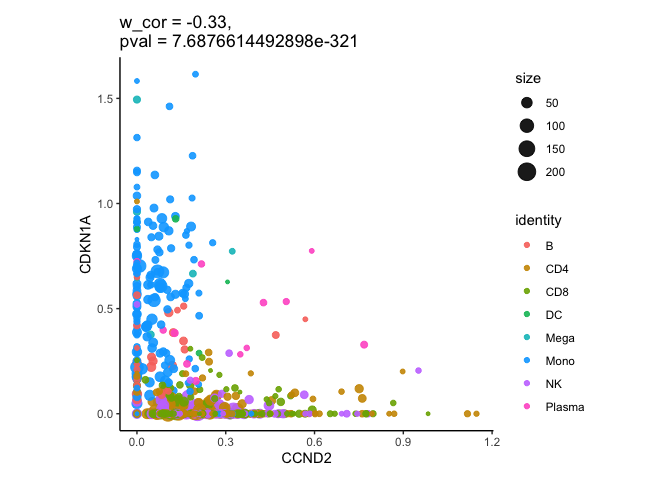
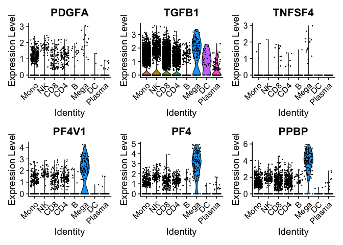
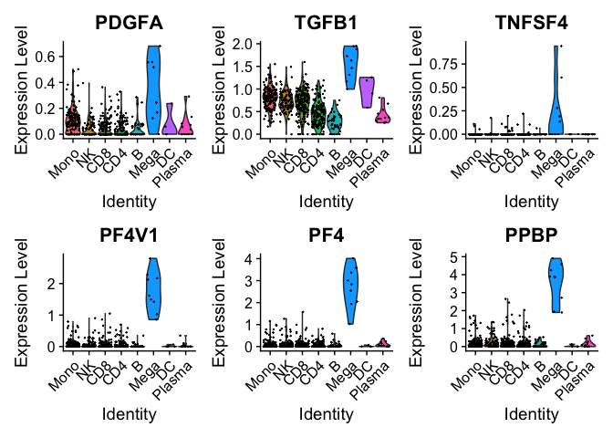

Metacell integration
================
Leonard Herault
2022-05-12

## library loading

``` r
library(SuperCell)
library(Seurat)
library(SingleCellExperiment)
library(ggplot2)
library(harmony)
library(reshape2)
```

In this tutorial we will make a short reanalysis of a large [single cell
transcriptome atlas of
COVID19](https://www.ncbi.nlm.nih.gov/pmc/articles/PMC7857060/) at the
metacell level. The original study gathered 1.4 millions of cells
distributed in 284 samples coming from 196 patients. Here we will focus
on a subset of 26 fresh PBMC samples.

## Analysis of one sample from covid 19 dataset

We start by analyzing a fresh PBMC sample from an aged patient that
deceased from a severe COVID 19. We will mainly consider the fist cell
annotation to major PBMC cell types coming from the original study
(‘majorType’ column in the metadata).

As in the original study we will discard immunoglobuline, ribosomal
protein and mitochondrial genes for the dimension reduction analysis and
the metacell construction.

These lists of genes were retrieved from the [genenames
website](www.genenames.org). In this tutorial we provide you the whole
gene blacklist as an R object.

``` r
gene_blacklist <- readRDS("../data/gene_blacklist.rds")
```

# Analysis at the single cell level with Seurat

Quality control (gene/cell filtering) was already done in the original
study. We go directly to dimension reduction on highly variable genes

``` r
pbmc <- readRDS("../data/pbmc_COVID19_sce/S-S086-2_sce.rds")

sceRawToSeurat<- function(pbmc,nfeatures = 1500) {
pbmc <- CreateSeuratObject(counts = assay(pbmc),meta.data = data.frame(colData(pbmc)))
pbmc <- FindVariableFeatures(pbmc,nfeatures = nfeatures)
VariableFeatures(pbmc) <- VariableFeatures(pbmc)[!VariableFeatures(pbmc) %in% gene_blacklist]
pbmc <- NormalizeData(pbmc)
return(pbmc)
}

pbmc <- sceRawToSeurat(pbmc)
```

First we can do a Principal Component Analysis (PCA) of this sample with
the Seurat package.

``` r
pbmc <- ScaleData(pbmc)
pbmc <- RunPCA(pbmc, npcs = 20)
ElbowPlot(pbmc) 
```

<!-- -->

``` r
PCAPlot(pbmc,group.by = "majorType")
```

<!-- -->

We can compute a 2D UMAP on the 20 first components of the PCA for
visualization

``` r
pbmc <-RunUMAP(pbmc, dims = c(1:20))
UMAPPlot(pbmc, group.by = "majorType")
```

<!-- -->

``` r
#UMAPPlot(pbmc, group.by = "celltype") + NoLegend()
```

We make a metacell Seurat object from the single cells of the sample. We
assign metacell to metadata label (`majorType`, `celltype`) with the
maximum absolute abundance within metacell thanks to the
`supercell_assign*` function. We compute purity of metacells according
to their assignment to the majorType annotation.

``` r
makeSeuratMC <- function(pbmc,
                         genes = NULL,
                         metaFields = c("majorType", "sampleID", "Age", "Sex", "celltype", "PatientID", "SARS.CoV.2", "Outcome", "datasets", "CoVID.19.severity", "Sample.time"),
                         returnMC = F) {
  
  if(is.null(genes)) {
    genes <- VariableFeatures(pbmc)
  }

MC <- SCimplify(GetAssayData(pbmc,slot = "data"),  # normalized gene expression matrix 
                 n.pc = 20,
                 k.knn = 5, # number of nearest neighbors to build kNN network
                 gamma = 20, # graining level
                 genes.use = genes )# will be the ones used for integration if input is seurat integrated data


MC$purity <- supercell_purity(clusters = pbmc$majorType,
                           supercell_membership = MC$membership)


for (m in metaFields) {
MC[[m]]<- supercell_assign(clusters = pbmc@meta.data[,m], # single-cell assigment to cell lines (clusters)
                                    supercell_membership = MC$membership, # single-cell assignment to super-cells
                                    method = "absolute")
}

GE <- supercell_GE(as.matrix(GetAssayData(pbmc,slot = "data")),groups = MC$membership)

seuratMC <- supercell_2_Seurat(SC.GE = GE,MC,fields = c(metaFields,"purity"))

res <- seuratMC

if (returnMC) {
  res <- list(seuratMC = seuratMC,SC = MC)
}


return(res)
}

supercells <- makeSeuratMC(pbmc,returnMC = T)
```

    ## [1] "Done: NormalizeData"
    ## [1] "Doing: data to normalized data"
    ## [1] "Doing: weighted scaling"
    ## [1] "Done: weighted scaling"

We use the Seurat workflow to analyse the sample at the metacell level.
Data scaling and PCA computation are weighted according to metacell size
with the `supercell_2_Seurat` function we just used.

``` r
seuratMC <- supercells$seuratMC
seuratMC <- RunUMAP(seuratMC,dims = c(1:20))
```

We compute the UMAP dimension reduction on the weighted PCA results for
visualization.

``` r
UMAPPlot(seuratMC,group.by = "majorType")
```

<!-- -->

We can use the Seurat workflow without taking into account the metacell
weights by restarting from the data scaling step. This will overwrite
the weighted downstream analysis results in the Seurat object.

``` r
seuratMC <- ScaleData(seuratMC)
seuratMC <- RunPCA(seuratMC, npcs = 20)
seuratMC <- RunUMAP(seuratMC,dims = c(1:10))
UMAPPlot(seuratMC,group.by = "majorType")
```

<!-- -->

To be noted that the splits in the CD8 and DC majorType assigned
metacells can be explained by the second level of clustering provided in
the original study (`celltype` column in the metadata).

``` r
UMAPPlot(seuratMC,group.by = "celltype") + NoLegend()
```

<!-- -->

We can check the distribution of metacell purities and sizes obtained.

``` r
ggplot(seuratMC@meta.data,aes(x=orig.ident,y=purity)) + geom_boxplot() + 
  ggplot(seuratMC@meta.data,aes(x=orig.ident,y=size)) + geom_boxplot() 
```

<!-- -->

# gene correlation analysis

The drop out noise is reduced with metacell analysis.

``` r
VlnPlot(pbmc, features = 'nFeature_RNA') 
```

<!-- -->

``` r
VlnPlot(seuratMC, feature = 'nFeature_RNA')
```

<!-- -->

This results in a better observation of gene-gene expression
correlation. To illustrate this we can look for correlations of
expression of CXCL8, one cytokine that came out of the original study
that migh be involved in severe COVID19, and transcription factors that
potentially regulate it.

``` r
gene<-as.matrix(GetAssayData(seuratMC)["CXCL8",])
correlations<-apply(as.matrix(GetAssayData(seuratMC)),1,function(x){cor(gene,x)})

tf <- read.table("../data/transcription.factor.activity.GO0003700.symbol.list")

correlations <- correlations[names(correlations) %in% tf$V1]
head(sort(abs(correlations),decreasing = T),n = 10)
```

    ##     KLF10    ZNF467   ZNF385A      GAS7      KLF4      SPI1     CREB5       FOS 
    ## 0.7478192 0.7443197 0.7143247 0.7117197 0.7097348 0.7096040 0.7070228 0.7046132 
    ##     CEBPD      LMO2 
    ## 0.6903713 0.6868367

``` r
FeatureScatter(object = pbmc, feature1 = "CXCL8", feature2 = 'KLF10',group.by = "majorType")
```

<!-- -->

``` r
FeatureScatter(object = seuratMC, feature1 = "CXCL8", feature2 = 'KLF10',group.by = "majorType")
```

<!-- -->

``` r
FeatureScatter(object = pbmc, feature1 = "CXCL8", feature2 = 'FOS',group.by = "majorType")
```

<!-- -->

``` r
FeatureScatter(object = seuratMC, feature1 = "CXCL8", feature2 = 'FOS',group.by = "majorType")
```

<!-- -->
We can also use the `supercell_GeneGenePlot` to have a view of the size
of the metacells. It outputs a weighted correlation according to
supercell sizes.

``` r
supercell_GeneGenePlot(GetAssayData(seuratMC),
                       gene_x = "CXCL8",gene_y = "FOS",
                       supercell_size = seuratMC$size,
                       clusters = seuratMC$majorType)
```

    ## $p

<!-- -->

    ## 
    ## $w.cor
    ## $w.cor$CXCL8_FOS
    ## [1] 0.7604067
    ## 
    ## 
    ## $w.pval
    ## $w.pval$CXCL8_FOS
    ## [1] 0

``` r
supercell_GeneGenePlot(GetAssayData(seuratMC),
                       gene_x = "CXCL8",gene_y = "KLF10",
                       supercell_size = seuratMC$size,
                       clusters = seuratMC$majorType)
```

    ## $p

<!-- -->

    ## 
    ## $w.cor
    ## $w.cor$CXCL8_KLF10
    ## [1] 0.8134285
    ## 
    ## 
    ## $w.pval
    ## $w.pval$CXCL8_KLF10
    ## [1] 0

We can also better appreciate the anticorrelation between CCND2 cycline
gene and CDKN1A, coding for a cell cycle inhibitor protein.

``` r
FeatureScatter(object = pbmc, feature1 = "CCND2", feature2 = 'CDKN1A',group.by = "majorType")
```

<!-- -->

``` r
supercell_GeneGenePlot(GetAssayData(seuratMC),
                       gene_x = "CCND2",gene_y = "CDKN1A",
                       supercell_size = seuratMC$size,
                       clusters = seuratMC$majorType)
```

    ## $p

<!-- -->

    ## 
    ## $w.cor
    ## $w.cor$CCND2_CDKN1A
    ## [1] -0.3283369
    ## 
    ## 
    ## $w.pval
    ## $w.pval$CCND2_CDKN1A
    ## [1] 7.687661e-321

# Data integration

We provide you a tutorial for integration at the single cell level
[here](Workbook_2_1__COVID19_integration_single_cells.Rmd) if you want to evaluate
the time and the memory needed for this analysis at this scale. Note
that even with 32GB of memory the integration of all 26 samples is
impossible at the single cell level.

# Data integration at the metacell level

*At least 16GB of memory are required to complete this analysis*.

If you have more than 20GB, you should be able to integrate all the
files we provided into `../data/pbmc_COVID19_sce`. (26 data sets, about
200,000 unique cells).

If you have between 16GB and 20GB of memory, you should be able to
integrate all the male samples (which are more evenly distributed across
the different conditions than the female samples). We provide you with
the list of male samples in the file `../data/lowMemFileList.rds` (17
data sets, about 130,000 individual cells).

If you have less than 16GB of memory, you can try to integrate a small
subset of 5\~6 samples, but the downstream analysis we propose will not
be very meaningful.

We will now integrate at the metacell level a subset of 26 samples of
fresh PBMCs from the original study gathering around 200 000 cells.

We will use a gamma of 20 (10 000 metacells if you process the 26 data
sets).

``` r
files <- list.files("../data/pbmc_COVID19_sce",full.names = T)

# Uncomment if you have less than 20GB of memory
 files <- readRDS("../data/lowMemFileList.rds")

# Uncomment if you less than 16GB of memory
files <- files[c(1:6)]

MC.list <- list()
MC.list[["S-S086-2"]] <- seuratMC
for (f in files[which(files != "../data/pbmc_COVID19_sce/S-S086-2_sce.rds")]) {
  smp <- readRDS(f)
  smp <- sceRawToSeurat(smp)
  seuratMC <- makeSeuratMC(smp)
  MC.list[[seuratMC$sampleID[1]]] <- seuratMC
}
```

    ## [1] "Done: NormalizeData"
    ## [1] "Doing: data to normalized data"
    ## [1] "Doing: weighted scaling"
    ## [1] "Done: weighted scaling"
    ## [1] "Done: NormalizeData"
    ## [1] "Doing: data to normalized data"
    ## [1] "Doing: weighted scaling"
    ## [1] "Done: weighted scaling"
    ## [1] "Done: NormalizeData"
    ## [1] "Doing: data to normalized data"
    ## [1] "Doing: weighted scaling"
    ## [1] "Done: weighted scaling"
    ## [1] "Done: NormalizeData"
    ## [1] "Doing: data to normalized data"
    ## [1] "Doing: weighted scaling"
    ## [1] "Done: weighted scaling"
    ## [1] "Done: NormalizeData"
    ## [1] "Doing: data to normalized data"
    ## [1] "Doing: weighted scaling"
    ## [1] "Done: weighted scaling"
    ## [1] "Done: NormalizeData"
    ## [1] "Doing: data to normalized data"
    ## [1] "Doing: weighted scaling"
    ## [1] "Done: weighted scaling"

We select the highly variable genes across samples for integration using
the Seurat procedure.

``` r
features <- SelectIntegrationFeatures(MC.list,nfeatures = 1500)

features <- features[!features %in% gene_blacklist]
```

# Seurat integration workflow

First we will use the Seurat [integration workflow for large
datasets]((https://satijalab.org/seurat/articles/integration_large_datasets.html))
using a reference based integration and the RPCA reduction dimension
method.

``` r
nSingleCells <- 0
for (i in 1:length(MC.list)) {
  MC.list[[i]] <- RenameCells(MC.list[[i]],add.cell.id = unique(MC.list[[i]]$sampleID))
  MC.list[[i]] <- ScaleData(MC.list[[i]],features = features)
  MC.list[[i]] <- RunPCA(MC.list[[i]] ,features = features,npcs = 20)
  nSingleCells <- nSingleCells + sum(MC.list[[i]]$size)
}
```

We can print the corresponding number of single cell we are about to
integrate at the metacell level

``` r
nSingleCells
```

    ## [1] 51595

The subset of samples come from male and female patients. As gender is
often a large source of variation at the transcriptomic level, we will
use the largest male and female samples as reference.

``` r
reference <- which(c("S-S086-2","S-M064") %in% names(MC.list)) 


  
anchors <- FindIntegrationAnchors(object.list = MC.list,
                                  reference = reference, 
                                  reduction = "rpca",
                                  anchor.features = features,
                                  dims = 1:20)

integrated <- IntegrateData(anchorset = anchors, dims = 1:20)
```

We can now use the classical Seurat workflow on the integrated object

``` r
DefaultAssay(integrated) = "integrated"
integrated <- ScaleData(integrated, verbose = T)
integrated <- RunPCA(integrated, verbose = FALSE)
integrated <- RunUMAP(integrated, dims = 1:20)
```

We check that our integration correctly mixed the different samples in
the reduced space by preserving differences between the different PBMC
types. We can also check that we don’t have a gender effect in the
integrated data.

``` r
UMAPPlot(integrated,group.by = "sampleID")
```

<!-- -->

``` r
UMAPPlot(integrated,group.by = "majorType")
```

<!-- -->

``` r
UMAPPlot(integrated,group.by = "Sex")
```

<!-- -->

Now we will use
[Harmony](https://www.nature.com/articles/s41592-019-0619-0), an other
integration method. We will use it inside the [Seurat
framework](https://htmlpreview.github.io/?https://github.com/satijalab/seurat.wrappers/blob/master/docs/harmony.html).

``` r
DefaultAssay(integrated) <- "RNA"
integrated <- ScaleData(integrated,features = features)
integrated <- RunPCA(integrated, npcs = 20, verbose = FALSE,features = features)

integrated <- RunHarmony(integrated,c("sampleID","datasets"),theta = c(2.5,1.5))
integrated <- RunUMAP(integrated,reduction = "harmony",
                      reduction.name = "umap.harmony",
                      dims = 1:20)
```

``` r
DimPlot(integrated,group.by = "sampleID", reduction = "umap.harmony")
```

<!-- -->

``` r
DimPlot(integrated,group.by = "majorType", reduction = "umap.harmony")
```

<!-- -->

The original study mainly focused on the analysis of variations in the
cell type composition according to COVID19 severity (control,
mild/moderate, severe) and the time of sampling (control, progression,
convalescence).

``` r
DimPlot(integrated,group.by = "Sample.time", reduction = "umap.harmony") 
```

<!-- -->

``` r
DimPlot(integrated,group.by = "CoVID.19.severity", reduction = "umap.harmony")
```

<!-- -->

In this tutorial we will make a short analysis of this at the metacell
level regarding the first level of annotation (PMBC major type). We can
compute the observed versus expected cell number ratio for each PBMC
type for the different conditions. We have to take into account the
supercell size for this analysis.

``` r
majorTypeCounts <- aggregate(integrated$size, by=list(majorType = integrated$majorType,Severity = integrated$CoVID.19.severity,Time = integrated$Sample.time), FUN=sum)


majorTypeCounts$group = paste(majorTypeCounts$Severity,majorTypeCounts$Time,sep = "_")

contingencyTable <- xtabs(x ~ group + majorType,data = majorTypeCounts)

res <- chisq.test(contingencyTable)

Roe <- res$observed/res$expected
```

As in the original study we observe an increase in the Megakaryocytes
cell proportion during the progression of severe/critical COVID compare
to the other condition.

``` r
melted_Roe <- melt(Roe, na.rm = TRUE)
# Heatmap
ggplot(data = melted_Roe, aes(majorType,group,  fill = value))+
 geom_tile() + scale_fill_gradient2(low = "blue", high = "red", mid = "white", 
   midpoint = 1, space = "Lab",
   name="Ro/e") +
  theme_minimal()+ 
 theme(axis.text.x = element_text(angle = 45, vjust = 1, 
    size = 12, hjust = 1))+
 coord_fixed()
```

<!-- -->
Without the few metacell assigned to macrophages found in the control
samples that overwrite the results:

``` r
ggplot(data = melted_Roe[melted_Roe$majorType != "Macro",], aes(majorType,group,  fill = value))+
 geom_tile() + scale_fill_gradient2(low = "blue", high = "red", mid = "white", 
   midpoint = 1, space = "Lab",
   name="Ro/e") +
  theme_minimal()+ 
 theme(axis.text.x = element_text(angle = 45, vjust = 1, 
    size = 12, hjust = 1))+
 coord_fixed()
```

<!-- -->

We can do a differentially expressed gene analysis to characterize the
gene markers of this population that seem to support progression of
severe/critical COVID. We perform this analysis at the metacell level
(on averaged normalized counts per metacell).

``` r
Idents(integrated) <- "majorType"
markersMega <- FindMarkers(integrated,ident.1 = "Mega", only.pos = T)
markersMega <- markersMega[markersMega$p_val_adj < 0.05, ]
markersMega[order(markersMega$avg_log2FC, decreasing = T), ]
```

    ##                     p_val avg_log2FC pct.1 pct.2     p_val_adj
    ## PPBP         8.798048e-17  7.1224445  1.00 0.475  2.458439e-12
    ## TUBB1        1.787797e-33  5.6060074  1.00 0.154  4.995641e-29
    ## PF4          9.451786e-21  5.4381004  1.00 0.312  2.641113e-16
    ## CAVIN2       2.613475e-24  5.2661376  1.00 0.242  7.302832e-20
    ## ACRBP        9.603380e-23  5.1864819  1.00 0.268  2.683473e-18
    ## HIST1H2AC    5.334823e-15  5.1533871  1.00 0.696  1.490710e-10
    ## GP9          3.554959e-47  4.6516065  1.00 0.099  9.933622e-43
    ## MPIG6B       4.792648e-24  4.6379768  0.95 0.208  1.339210e-19
    ## RGS18        2.711806e-17  4.5926316  1.00 0.421  7.577600e-13
    ## GNG11        1.070423e-29  4.5470529  1.00 0.181  2.991084e-25
    ## TSC22D1      1.239848e-21  4.4284209  1.00 0.291  3.464508e-17
    ## SPARC        2.235844e-22  4.4018969  1.00 0.270  6.247619e-18
    ## CLU          1.919379e-17  3.9431320  1.00 0.419  5.363319e-13
    ## TUBA4A       2.565241e-14  3.8491556  1.00 0.895  7.168054e-10
    ## NRGN         7.178276e-17  3.8085049  1.00 0.462  2.005826e-12
    ## TMEM40       1.398545e-51  3.7368592  1.00 0.089  3.907955e-47
    ## F13A1        5.281392e-17  3.7359550  0.95 0.321  1.475779e-12
    ## LIMS1        1.921329e-11  3.7258815  0.95 0.833  5.368770e-07
    ## PTCRA        6.839376e-79  3.6868013  1.00 0.052  1.911127e-74
    ## MPP1         6.136348e-15  3.6571778  1.00 0.585  1.714680e-10
    ## CMTM5        2.548534e-66  3.6176006  1.00 0.065  7.121367e-62
    ## TRIM58       1.366918e-28  3.6074045  0.95 0.164  3.819579e-24
    ## AP003068.2   6.528918e-22  3.5645760  0.95 0.237  1.824376e-17
    ## MAX          3.346484e-13  3.5344818  1.00 0.952  9.351081e-09
    ## PTGS1        7.382227e-21  3.4939902  1.00 0.306  2.062816e-16
    ## TREML1       6.360416e-33  3.4932391  0.95 0.137  1.777291e-28
    ## GRAP2        8.466293e-15  3.4617350  1.00 0.611  2.365736e-10
    ## CTSA         1.344693e-13  3.4210230  1.00 0.877  3.757477e-09
    ## RGS10        1.694272e-13  3.3668941  1.00 0.929  4.734305e-09
    ## MMD          7.258874e-17  3.3103935  1.00 0.461  2.028347e-12
    ## RAP1B        3.281450e-13  3.3004125  1.00 0.982  9.169356e-09
    ## MAP3K7CL     6.128240e-16  3.2875695  1.00 0.457  1.712414e-11
    ## TPM4         9.164502e-11  3.2399735  1.00 0.898  2.560837e-06
    ## ITGA2B       1.755350e-30  3.2193614  0.95 0.151  4.904973e-26
    ## RUFY1        5.176003e-15  3.1840107  1.00 0.618  1.446331e-10
    ## NCOA4        3.998576e-11  3.1722979  1.00 0.911  1.117322e-06
    ## TAGLN2       1.915171e-13  3.1002685  1.00 0.999  5.351563e-09
    ## ESAM         9.414045e-38  3.0817607  0.95 0.115  2.630566e-33
    ## NT5C3A       2.080420e-14  3.0600008  1.00 0.881  5.813318e-10
    ## YWHAH        1.384064e-13  3.0596047  1.00 0.777  3.867491e-09
    ## MYL9         5.606047e-28  3.0588340  1.00 0.193  1.566498e-23
    ## FERMT3       4.682912e-11  3.0028249  1.00 0.945  1.308546e-06
    ## PGRMC1       8.172653e-15  2.9860043  1.00 0.682  2.283685e-10
    ## VCL          3.638508e-14  2.9519862  1.00 0.742  1.016708e-09
    ## BEX3         5.575216e-17  2.9441339  1.00 0.443  1.557883e-12
    ## C2orf88      3.737692e-37  2.9177364  1.00 0.134  1.044423e-32
    ## PDLIM1       3.556552e-15  2.9057166  0.95 0.404  9.938073e-11
    ## PTPN18       4.068041e-11  2.8932044  0.95 0.850  1.136733e-06
    ## TLN1         1.014045e-12  2.8739676  1.00 0.960  2.833547e-08
    ## NFE2         1.214226e-17  2.7156564  1.00 0.308  3.392910e-13
    ## HIST1H2BJ    8.449981e-26  2.6910679  1.00 0.214  2.361178e-21
    ## NAP1L1       3.776395e-13  2.6851183  1.00 0.980  1.055238e-08
    ## DMTN         7.603440e-36  2.6082060  1.00 0.141  2.124629e-31
    ## GSTO1        8.881452e-10  2.5828438  1.00 0.932  2.481744e-05
    ## RAB11A       2.508243e-12  2.5494966  1.00 0.941  7.008783e-08
    ## ILK          4.845168e-12  2.5419858  1.00 0.854  1.353885e-07
    ## SMIM3        8.074909e-17  2.5407522  1.00 0.453  2.256372e-12
    ## RSU1         4.919326e-14  2.5378096  1.00 0.914  1.374607e-09
    ## KIF2A        8.144769e-13  2.5132310  1.00 0.887  2.275893e-08
    ## RNF11        2.254539e-11  2.5114346  0.95 0.762  6.299859e-07
    ## EIF2AK1      1.325892e-11  2.4813704  0.95 0.857  3.704939e-07
    ## ACTN1        3.358613e-14  2.4587761  1.00 0.599  9.384971e-10
    ## ADIPOR1      1.438536e-11  2.4381672  0.95 0.870  4.019701e-07
    ## SLC40A1      1.254986e-15  2.3951588  0.95 0.373  3.506808e-11
    ## CLEC1B       7.521455e-30  2.3751451  1.00 0.180  2.101720e-25
    ## OAZ1         1.599417e-11  2.3697335  1.00 1.000  4.469250e-07
    ## GPX4         4.110416e-13  2.3437343  1.00 0.989  1.148574e-08
    ## TIMP1        1.516656e-12  2.3191605  1.00 0.862  4.237991e-08
    ## CDKN1A       3.999359e-11  2.3123043  1.00 0.515  1.117541e-06
    ## SMOX         9.958226e-40  2.2837344  0.95 0.108  2.782627e-35
    ## RAB27B       3.780294e-17  2.2679528  0.90 0.256  1.056328e-12
    ## MYLK         3.358757e-24  2.2470593  0.95 0.203  9.385376e-20
    ## CMIP         2.182507e-10  2.2325920  0.95 0.677  6.098580e-06
    ## DAB2         6.211516e-16  2.2301490  0.90 0.308  1.735684e-11
    ## CALM3        5.988685e-11  2.2223505  1.00 0.979  1.673418e-06
    ## OST4         1.720343e-14  2.2100923  1.00 0.998  4.807156e-10
    ## TMEM140      2.228924e-15  2.2094852  1.00 0.561  6.228283e-11
    ## PLA2G12A     2.143833e-13  2.2006194  0.95 0.553  5.990514e-09
    ## FAM110A      1.771071e-11  2.1950105  0.95 0.643  4.948903e-07
    ## PF4V1        7.533794e-37  2.1792382  0.95 0.118  2.105168e-32
    ## SNAP23       4.405883e-10  2.1657164  0.95 0.882  1.231136e-05
    ## H3F3A        4.834418e-10  2.1642356  1.00 1.000  1.350881e-05
    ## ODC1         3.181865e-11  2.1585448  0.95 0.758  8.891085e-07
    ## WBP2         1.196622e-11  2.1555136  1.00 0.920  3.343721e-07
    ## GMPR         1.137730e-25  2.1534960  1.00 0.219  3.179158e-21
    ## CD9          5.797850e-18  2.1312132  0.95 0.288  1.620093e-13
    ## TPST2        2.010115e-11  2.1292313  0.95 0.861  5.616864e-07
    ## CCND3        6.253867e-08  2.1277526  1.00 0.985  1.747518e-03
    ## STOM         5.608293e-12  2.1156627  0.95 0.783  1.567125e-07
    ## AC147651.1   5.400716e-53  2.1137876  0.90 0.066  1.509122e-48
    ## TUBA8        5.688407e-96  2.1006736  0.95 0.036  1.589512e-91
    ## H2AFJ        3.136280e-10  2.0904420  0.95 0.910  8.763708e-06
    ## LMNA         6.464066e-12  2.0645375  0.95 0.490  1.806254e-07
    ## GUCY1B1      4.922270e-24  2.0503316  0.90 0.176  1.375430e-19
    ## TMBIM1       3.097023e-11  2.0421872  0.95 0.893  8.654012e-07
    ## PARVB        1.999877e-07  2.0420578  0.85 0.574  5.588257e-03
    ## PKM          1.895442e-10  2.0375709  1.00 0.989  5.296434e-06
    ## GAS2L1       5.711506e-25  2.0282614  0.95 0.196  1.595966e-20
    ## ARHGAP6      1.605163e-51  2.0030453  1.00 0.088  4.485306e-47
    ## LAMTOR1      1.074525e-11  1.9974746  1.00 0.978  3.002545e-07
    ## R3HDM4       9.721504e-12  1.9862665  1.00 0.878  2.716480e-07
    ## MFSD1        3.884851e-11  1.9808930  0.95 0.778  1.085544e-06
    ## ETFA         3.490876e-13  1.9591512  1.00 0.882  9.754554e-09
    ## YWHAZ        2.326433e-08  1.9475089  1.00 0.999  6.500751e-04
    ## PRKAR2B      2.339755e-23  1.9391033  0.95 0.216  6.537977e-19
    ## CA2          9.289863e-19  1.9208762  0.85 0.202  2.595866e-14
    ## GP1BA        1.977721e-92  1.9170739  0.90 0.033  5.526346e-88
    ## LINC00989    9.563830e-55  1.9112175  0.90 0.062  2.672421e-50
    ## ARHGAP18     8.493454e-11  1.9102600  0.90 0.541  2.373326e-06
    ## SNCA         1.124492e-23  1.9063895  0.95 0.209  3.142167e-19
    ## PRDX6        4.993352e-11  1.8922329  1.00 0.978  1.395292e-06
    ## CTTN         8.150043e-31  1.8752163  0.90 0.127  2.277366e-26
    ## CLDN5       4.826140e-111  1.8412492  0.80 0.020 1.348568e-106
    ## TNS1         4.810405e-18  1.8384666  0.80 0.165  1.344172e-13
    ## DAPP1        2.209048e-11  1.8372477  1.00 0.610  6.172744e-07
    ## CD99         1.437816e-09  1.8235164  1.00 0.988  4.017689e-05
    ## ITM2B        2.396721e-09  1.8176727  1.00 0.996  6.697156e-05
    ## THBS1        2.267502e-10  1.8102247  0.95 0.635  6.336082e-06
    ## WDR1         1.555771e-10  1.7951610  1.00 0.968  4.347291e-06
    ## ITGB3        1.035944e-63  1.7895019  0.90 0.052  2.894739e-59
    ## NEXN         1.144079e-18  1.7773529  1.00 0.361  3.196900e-14
    ## RASGRP2      4.387198e-10  1.7478256  1.00 0.964  1.225915e-05
    ## ALOX12       3.595379e-60  1.7419319  0.95 0.064  1.004657e-55
    ## RIOK3        2.645585e-08  1.7316952  0.95 0.938  7.392558e-04
    ## BCL2L1       4.356051e-10  1.7144460  0.90 0.582  1.217211e-05
    ## HIST1H3H     1.567792e-20  1.7049270  1.00 0.288  4.380882e-16
    ## FAXDC2       1.096742e-43  1.7006945  0.95 0.096  3.064627e-39
    ## CAPZA2       7.133000e-09  1.6762807  1.00 0.936  1.993174e-04
    ## LAT          4.625290e-10  1.6720803  1.00 0.765  1.292445e-05
    ## MARCH2       1.334046e-15  1.6715991  1.00 0.557  3.727724e-11
    ## NORAD        3.716487e-12  1.6703346  1.00 0.863  1.038498e-07
    ## AP000547.3   2.999853e-23  1.6562418  1.00 0.250  8.382488e-19
    ## ICAM2        2.859898e-11  1.6389684  1.00 0.903  7.991412e-07
    ## TGFB1        3.613059e-12  1.6296910  1.00 0.955  1.009597e-07
    ## CORO1C       1.073862e-11  1.6255222  0.95 0.502  3.000693e-07
    ## AP001189.1   1.073052e-52  1.6237174  0.95 0.075  2.998429e-48
    ## MYL12A       8.617444e-10  1.6038319  1.00 0.999  2.407972e-05
    ## CNST         1.143692e-10  1.5830134  1.00 0.843  3.195820e-06
    ## SH3BGRL2     4.262360e-44  1.5821050  0.90 0.082  1.191031e-39
    ## MGLL         8.419959e-24  1.5812919  0.95 0.209  2.352789e-19
    ## CARD19       3.615471e-11  1.5791552  0.95 0.726  1.010271e-06
    ## AC090409.1  6.166508e-104  1.5754014  0.90 0.029  1.723107e-99
    ## DNAJB6       2.984083e-08  1.5603835  1.00 0.954  8.338423e-04
    ## TLK1         1.932457e-12  1.5602222  1.00 0.840  5.399864e-08
    ## AC114752.2  7.599238e-100  1.5496275  0.95 0.034  2.123455e-95
    ## SLA2         4.176849e-12  1.5462115  0.95 0.544  1.167137e-07
    ## ZNF185       1.202443e-18  1.5193087  0.95 0.272  3.359986e-14
    ## LTBP1       1.940734e-139  1.5157830  0.95 0.022 5.422994e-135
    ## HLA-E        1.517387e-10  1.5031060  1.00 1.000  4.240034e-06
    ## CAP1         1.314438e-06  1.5019425  1.00 0.981  3.672933e-02
    ## AKIRIN2      4.096107e-09  1.4999324  0.95 0.928  1.144575e-04
    ## AL731557.1  3.549783e-127  1.4931788  1.00 0.028 9.919158e-123
    ## C19orf33     6.280972e-27  1.4903589  0.50 0.038  1.755092e-22
    ## TMEM91       2.450929e-13  1.4846434  0.95 0.490  6.848632e-09
    ## LDLRAP1      1.106308e-11  1.4751800  1.00 0.667  3.091357e-07
    ## GP6          1.414639e-49  1.4722236  0.90 0.071  3.952925e-45
    ## STON2        4.923806e-35  1.4627286  0.85 0.094  1.375859e-30
    ## NDUFA6       5.751505e-10  1.4623296  1.00 0.966  1.607143e-05
    ## TALDO1       9.435551e-07  1.4592369  1.00 0.960  2.636576e-02
    ## DYNLL1       5.086472e-08  1.4575521  1.00 0.945  1.421313e-03
    ## CYB5R3       1.083617e-11  1.4412337  1.00 0.845  3.027950e-07
    ## ENKUR        1.389924e-36  1.4407676  0.65 0.047  3.883864e-32
    ## ABCC3        3.364332e-24  1.4215318  0.95 0.202  9.400953e-20
    ## RIPOR2       4.671558e-11  1.4184268  1.00 0.988  1.305373e-06
    ## TPM1         2.961901e-11  1.4162140  0.85 0.430  8.276440e-07
    ## TMEM50A      3.799460e-10  1.4106434  0.95 0.985  1.061683e-05
    ## CD226        1.354351e-10  1.4069745  0.90 0.557  3.784463e-06
    ## RBX1         1.234227e-09  1.4036011  1.00 0.963  3.448800e-05
    ## ARF1         2.752188e-07  1.4035290  1.00 0.998  7.690440e-03
    ## MED12L       7.272996e-51  1.3839101  0.90 0.069  2.032293e-46
    ## RAB37        2.720060e-08  1.3782307  0.95 0.744  7.600663e-04
    ## HIST1H1C     4.605839e-09  1.3758948  1.00 0.866  1.287009e-04
    ## MCUR1        2.114577e-09  1.3683802  0.90 0.670  5.908762e-05
    ## RAB32        1.856357e-14  1.3678508  0.95 0.327  5.187219e-10
    ## CAPN1        4.848924e-09  1.3676219  0.95 0.876  1.354935e-04
    ## VIM-AS1      4.777165e-18  1.3623978  1.00 0.360  1.334883e-13
    ## XPNPEP1      3.893703e-11  1.3525864  0.95 0.695  1.088017e-06
    ## MINDY1       4.194427e-15  1.3470508  0.90 0.305  1.172049e-10
    ## SH3BGRL3     1.052845e-09  1.3279177  1.00 1.000  2.941965e-05
    ## RDH11        8.198625e-11  1.3275911  0.95 0.788  2.290942e-06
    ## NUTF2        1.405406e-08  1.3238753  0.95 0.924  3.927127e-04
    ## SNN          6.878383e-16  1.3175226  1.00 0.477  1.922027e-11
    ## PNMA1        1.493592e-13  1.3128368  0.90 0.396  4.173545e-09
    ## ANO6         1.969439e-10  1.3120777  0.95 0.749  5.503204e-06
    ## GFI1B        8.024824e-37  1.3105257  0.90 0.101  2.242376e-32
    ## LGALS12      6.655544e-34  1.2976773  0.80 0.084  1.859759e-29
    ## TUBB4B       3.696144e-08  1.2875794  1.00 0.876  1.032813e-03
    ## PYGL         4.411147e-09  1.2821041  0.85 0.353  1.232607e-04
    ## CCNG1        8.157690e-11  1.2762639  1.00 0.895  2.279503e-06
    ## PSTPIP2      1.726483e-09  1.2715996  0.95 0.611  4.824312e-05
    ## FKBP1A       6.113458e-07  1.2671035  1.00 0.973  1.708284e-02
    ## LEPROT       2.122098e-10  1.2627541  0.95 0.768  5.929778e-06
    ## BEND2        2.467069e-57  1.2586583  0.90 0.059  6.893730e-53
    ## GSN          1.041396e-09  1.2539441  0.90 0.543  2.909972e-05
    ## PTGIR        6.600737e-14  1.2529299  0.95 0.415  1.844444e-09
    ## EMC3         1.685432e-09  1.2407645  0.95 0.938  4.709603e-05
    ## SPNS1        8.318497e-08  1.2360544  0.85 0.696  2.324438e-03
    ## FHL1         3.149194e-11  1.2297184  0.75 0.249  8.799792e-07
    ## UBL4A        1.441296e-10  1.2257392  0.95 0.597  4.027414e-06
    ## PTTG1IP      2.473543e-07  1.2228504  0.95 0.815  6.911820e-03
    ## GLUL         1.072690e-08  1.2220580  0.95 0.789  2.997418e-04
    ## SOD2         3.423186e-11  1.2175020  1.00 0.943  9.565409e-07
    ## EHD3         6.254008e-23  1.2168472  0.85 0.156  1.747557e-18
    ## TNFSF4       3.845385e-48  1.2117651  0.75 0.048  1.074516e-43
    ## SLC44A2      4.705417e-13  1.2097253  1.00 0.891  1.314835e-08
    ## MMRN1        2.975927e-67  1.2095543  0.75 0.032  8.315631e-63
    ## MYL6         6.765645e-07  1.2064135  1.00 0.999  1.890524e-02
    ## AC010186.1   3.395805e-35  1.1927060  0.70 0.059  9.488897e-31
    ## SELP         7.950480e-86  1.1906777  0.90 0.036  2.221603e-81
    ## TACC3        2.602991e-09  1.1898605  0.95 0.696  7.273538e-05
    ## ENDOD1       4.312406e-16  1.1866474  0.95 0.382  1.205016e-11
    ## HBD          1.600174e-36  1.1852480  0.50 0.027  4.471366e-32
    ## AMD1         5.590567e-08  1.1728090  0.95 0.912  1.562172e-03
    ## RAB1B        5.192465e-10  1.1654658  0.95 0.939  1.450931e-05
    ## ASAH1        2.365641e-07  1.1535329  1.00 0.915  6.610310e-03
    ## MTURN        1.244516e-22  1.1510293  0.90 0.191  3.477552e-18
    ## DERA         4.370229e-08  1.1408951  0.85 0.657  1.221173e-03
    ## FRMD3        6.050575e-12  1.1297659  0.90 0.426  1.690712e-07
    ## MKRN1        2.707357e-08  1.1296561  0.95 0.919  7.565169e-04
    ## YPEL5        9.830915e-10  1.1279190  1.00 0.968  2.747052e-05
    ## ITGB1        9.527528e-08  1.1238049  0.95 0.900  2.662277e-03
    ## CD151        4.035269e-12  1.1201459  1.00 0.710  1.127575e-07
    ## GATA1       5.423193e-152  1.1192875  0.75 0.011 1.515403e-147
    ## MFAP3L       1.338222e-69  1.1154287  0.75 0.030  3.739394e-65
    ## TBXA2R       2.998800e-21  1.1085069  0.75 0.125  8.379546e-17
    ## GADD45A      2.181244e-10  1.1070673  0.90 0.487  6.095049e-06
    ## RAP2B        1.177141e-06  1.1044118  0.90 0.801  3.289284e-02
    ## MIR4435-2HG  5.537188e-11  1.1015894  1.00 0.687  1.547256e-06
    ## VDAC3        2.290385e-09  1.0994998  1.00 0.912  6.400024e-05
    ## MOB1B        3.346936e-10  1.0962663  0.85 0.450  9.352344e-06
    ## FTH1         1.536649e-07  1.0953900  1.00 1.000  4.293859e-03
    ## P2RX1        2.227310e-13  1.0760336  0.90 0.331  6.223774e-09
    ## MOB1A        2.249535e-08  1.0728044  1.00 0.965  6.285874e-04
    ## BNIP2        8.339791e-08  1.0707375  1.00 0.929  2.330388e-03
    ## PDE5A        2.866662e-27  1.0676798  0.90 0.147  8.010312e-23
    ## RAB4A        1.596601e-06  1.0670992  0.85 0.805  4.461381e-02
    ## MT-ND2       2.040476e-09  1.0669408  1.00 1.000  5.701703e-05
    ## MLH3         7.828299e-12  1.0667979  0.85 0.391  2.187462e-07
    ## CMTM6        6.391672e-08  1.0609968  1.00 0.950  1.786025e-03
    ## AC123912.4   8.445661e-62  1.0576576  0.75 0.036  2.359971e-57
    ## PDZK1IP1     1.843700e-88  1.0542911  0.75 0.023  5.151850e-84
    ## SVIP         2.604773e-09  1.0534836  0.90 0.695  7.278516e-05
    ## UQCRH        4.737439e-07  1.0517942  1.00 0.997  1.323783e-02
    ## PDCD10       7.058007e-10  1.0514048  1.00 0.907  1.972219e-05
    ## INF2         2.581034e-07  1.0504575  0.75 0.471  7.212184e-03
    ## HGD          9.059289e-75  1.0498166  0.70 0.024  2.531437e-70
    ## HIST1H2BC    2.858290e-10  1.0408353  0.90 0.546  7.986920e-06
    ## AQP10       2.631724e-150  1.0407320  0.85 0.015 7.353828e-146
    ## PRUNE1       7.904850e-08  1.0391402  0.75 0.426  2.208852e-03
    ## RAB8A        2.243925e-08  1.0347897  0.95 0.922  6.270200e-04
    ## SCN1B        2.558223e-24  1.0345060  0.95 0.200  7.148442e-20
    ## CLCN3        4.265770e-08  1.0332527  0.85 0.651  1.191984e-03
    ## PIP4P2       1.563991e-11  1.0252554  0.95 0.574  4.370260e-07
    ## HIST1H2BK    2.784648e-10  1.0169635  0.95 0.582  7.781141e-06
    ## AC008763.1   1.268191e-20  1.0108092  0.75 0.127  3.543706e-16
    ## F2R          5.390561e-12  0.9948740  0.95 0.453  1.506285e-07
    ## EGFL7        1.741726e-41  0.9937458  0.85 0.076  4.866904e-37
    ## AGPAT1       2.383030e-08  0.9909121  0.90 0.704  6.658900e-04
    ## INKA1        7.493108e-44  0.9896798  0.90 0.081  2.093799e-39
    ## PBX1         2.168621e-23  0.9877454  0.85 0.152  6.059777e-19
    ## LYPLAL1      2.881945e-10  0.9802677  0.95 0.601  8.053020e-06
    ## HACD4        1.981580e-08  0.9744725  1.00 0.922  5.537130e-04
    ## IFRD1        6.993301e-07  0.9715798  0.90 0.856  1.954138e-02
    ## SENCR        2.791089e-14  0.9674377  0.75 0.200  7.799140e-10
    ## RNF24        2.891156e-11  0.9643562  0.95 0.587  8.078758e-07
    ## ELF1         1.312800e-07  0.9633377  1.00 0.980  3.668358e-03
    ## SUPT4H1      7.064167e-09  0.9612200  1.00 0.954  1.973940e-04
    ## HEMGN        3.004779e-41  0.9581126  0.85 0.077  8.396253e-37
    ## NDUFAF3      9.523242e-12  0.9485748  1.00 0.915  2.661079e-07
    ## PAIP2        3.528708e-11  0.9473384  1.00 0.982  9.860267e-07
    ## PNKD         4.534965e-07  0.9460587  1.00 0.930  1.267205e-02
    ## SSX2IP       4.719198e-13  0.9354178  0.80 0.258  1.318686e-08
    ## ERV3-1       9.913884e-08  0.9315529  0.80 0.470  2.770237e-03
    ## SMIM5        2.241575e-56  0.9197975  0.90 0.060  6.263634e-52
    ## TNNC2        3.898425e-57  0.9192073  0.95 0.068  1.089337e-52
    ## WIPF1        7.481731e-07  0.9157284  0.95 0.977  2.090620e-02
    ## ARL6IP5      1.255864e-07  0.9118112  1.00 0.985  3.509262e-03
    ## KCTD20       2.315938e-09  0.9037760  0.95 0.733  6.471427e-05
    ## LY6G6F      1.298090e-132  0.8993859  0.70 0.011 3.627253e-128
    ## APP          1.231438e-09  0.8922024  0.90 0.577  3.441008e-05
    ## CMPK1        1.055292e-09  0.8892713  0.95 0.901  2.948802e-05
    ## RAB31        7.568019e-08  0.8883466  0.95 0.425  2.114731e-03
    ## NAT8         3.140001e-89  0.8869623  0.65 0.016  8.774104e-85
    ## VAPA         6.687870e-08  0.8867109  1.00 0.977  1.868792e-03
    ## ABLIM3       6.257039e-68  0.8847841  0.95 0.054  1.748404e-63
    ## MAPRE2       1.285461e-06  0.8823032  0.95 0.886  3.591964e-02
    ## TAX1BP3      1.593614e-14  0.8768476  1.00 0.588  4.453034e-10
    ## CDIP1        3.136246e-07  0.8733898  0.85 0.606  8.763612e-03
    ## SSBP2        6.822900e-07  0.8705672  0.90 0.682  1.906523e-02
    ## ZCCHC17      7.053183e-10  0.8704476  0.95 0.741  1.970871e-05
    ## HK1          3.596022e-07  0.8696332  0.95 0.809  1.004837e-02
    ## LGALSL       3.194037e-76  0.8693016  0.85 0.037  8.925096e-72
    ## LYL1         3.124689e-09  0.8690849  0.85 0.414  8.731317e-05
    ## KIAA0513     3.406887e-09  0.8649519  0.90 0.451  9.519864e-05
    ## CERS2        4.729566e-07  0.8628966  0.85 0.738  1.321583e-02
    ## UBE2E3       1.247044e-08  0.8564725  0.95 0.837  3.484615e-04
    ## UBAC2        1.232992e-10  0.8534142  1.00 0.922  3.445350e-06
    ## MAP1A        1.033206e-43  0.8460536  0.80 0.061  2.887088e-39
    ## TAL1         5.000419e-45  0.8448411  0.85 0.070  1.397267e-40
    ## GNAS         7.610289e-07  0.8440837  1.00 0.978  2.126543e-02
    ## AP2M1        6.180514e-07  0.8411831  1.00 0.973  1.727021e-02
    ## RTN3         7.678320e-07  0.8389390  0.95 0.863  2.145553e-02
    ## GTPBP2       2.208091e-08  0.8362990  0.75 0.365  6.170069e-04
    ## LCN2         1.380401e-66  0.8348477  0.85 0.043  3.857253e-62
    ## SPINT2       9.345551e-09  0.8340471  0.95 0.605  2.611427e-04
    ## PLEKHO1      6.000838e-07  0.8325772  0.85 0.643  1.676814e-02
    ## CPNE5        6.688920e-15  0.8283858  0.80 0.192  1.869085e-10
    ## ZC3HAV1L     1.503900e-15  0.8195203  0.60 0.104  4.202348e-11
    ## CYTOR        7.387690e-09  0.8151765  0.95 0.832  2.064342e-04
    ## FAH          4.899634e-13  0.8082055  0.85 0.334  1.369105e-08
    ## GLA          1.966421e-08  0.8040953  0.90 0.592  5.494770e-04
    ## AP001636.3   3.968399e-52  0.8016891  0.85 0.057  1.108890e-47
    ## PRKAR1B      4.367033e-13  0.7980955  0.90 0.406  1.220280e-08
    ## PROS1        2.463918e-49  0.7964022  0.80 0.054  6.884926e-45
    ## PARK7        1.398670e-06  0.7938942  1.00 0.990  3.908304e-02
    ## MFSD2B       1.455685e-66  0.7915323  0.80 0.038  4.067620e-62
    ## SWI5         7.300633e-07  0.7895848  0.80 0.560  2.040016e-02
    ## GNAZ         1.236375e-54  0.7852260  0.80 0.048  3.454801e-50
    ## HIST1H2AG    1.870986e-07  0.7782878  0.75 0.376  5.228095e-03
    ## TSPAN9      1.757638e-140  0.7754254  0.85 0.016 4.911367e-136
    ## CABP5       1.055999e-123  0.7753161  0.60 0.008 2.950778e-119
    ## UBA7         8.346115e-08  0.7712120  0.90 0.785  2.332155e-03
    ## SEPT11       7.077894e-08  0.7670514  0.85 0.570  1.977776e-03
    ## SLC10A3      5.085504e-11  0.7655357  0.95 0.615  1.421042e-06
    ## H1F0         6.114652e-11  0.7596413  0.80 0.315  1.708617e-06
    ## IGF2BP3      1.261036e-21  0.7584473  0.65 0.086  3.523712e-17
    ## RGS6         1.273374e-98  0.7561387  0.85 0.027  3.558188e-94
    ## ABCC4        3.951398e-11  0.7547839  0.80 0.303  1.104139e-06
    ## ABHD4        1.123511e-13  0.7532552  0.85 0.296  3.139427e-09
    ## INSIG1       3.372150e-07  0.7392416  0.90 0.761  9.422798e-03
    ## ABHD16A      1.315670e-12  0.7379541  1.00 0.652  3.676376e-08
    ## PKHD1L1      5.986556e-47  0.7349125  0.80 0.057  1.672823e-42
    ## ELOVL7       5.501244e-85  0.7336314  0.90 0.037  1.537213e-80
    ## SPHK1        1.251469e-11  0.7304064  0.80 0.272  3.496980e-07
    ## DNM3         1.355969e-44  0.7280790  0.85 0.070  3.788985e-40
    ## TRAPPC3L     5.392332e-08  0.7275885  0.65 0.255  1.506779e-03
    ## YIF1B        1.559125e-06  0.7239078  0.90 0.808  4.356664e-02
    ## CYB5R1       3.158433e-08  0.7237643  0.95 0.690  8.825609e-04
    ## SLC44A1      2.989178e-08  0.7199161  0.90 0.592  8.352660e-04
    ## MOB3C        1.288675e-06  0.7184785  0.65 0.319  3.600944e-02
    ## MEIS1        1.214381e-19  0.7133443  0.75 0.136  3.393346e-15
    ## TST          6.884642e-08  0.7128132  0.75 0.326  1.923776e-03
    ## TSPAN18      1.288701e-23  0.7088625  0.75 0.107  3.601017e-19
    ## VAMP7        7.506902e-10  0.7022657  0.95 0.717  2.097654e-05
    ## EGLN3        4.150235e-28  0.7016139  0.75 0.089  1.159700e-23
    ## PPP1R14A     1.748898e-17  0.7001856  0.60 0.084  4.886945e-13
    ## TGFB1I1      7.565008e-24  0.6961474  0.80 0.128  2.113890e-19
    ## MAGED2       3.280576e-07  0.6955888  0.90 0.734  9.166913e-03
    ## TM2D2        5.487988e-07  0.6952574  0.80 0.523  1.533509e-02
    ## TSPAN33      1.478299e-16  0.6933927  0.75 0.168  4.130811e-12
    ## FRMD4B       2.573656e-09  0.6880291  0.90 0.440  7.191568e-05
    ## INKA2        3.880414e-24  0.6752683  0.75 0.108  1.084304e-19
    ## CHMP6        3.221708e-10  0.6710359  0.95 0.682  9.002418e-06
    ## CRAT         5.830850e-08  0.6693690  0.80 0.448  1.629315e-03
    ## CRYL1        1.689075e-07  0.6667858  0.90 0.654  4.719784e-03
    ## CXCL5        9.473992e-38  0.6613007  0.50 0.025  2.647318e-33
    ## ARG2         4.573130e-34  0.6568847  0.80 0.083  1.277870e-29
    ## DAP          5.437096e-09  0.6536053  0.90 0.790  1.519288e-04
    ## C1orf198     1.056261e-32  0.6506866  0.80 0.088  2.951509e-28
    ## RHEB         2.266548e-07  0.6465072  0.95 0.824  6.333415e-03
    ## PPP3R1       5.684908e-09  0.6397773  0.95 0.690  1.588534e-04
    ## PBXIP1       4.480871e-08  0.6378080  0.95 0.850  1.252090e-03
    ## SMIM1        6.120908e-16  0.6376382  0.75 0.169  1.710365e-11
    ## ACTR3B       1.438989e-11  0.6360596  0.80 0.289  4.020966e-07
    ## KIFC3        4.374190e-18  0.6291758  0.85 0.194  1.222280e-13
    ## CTNNAL1      2.557884e-17  0.6271102  0.75 0.149  7.147496e-13
    ## PTK2         1.747725e-13  0.6269328  0.85 0.289  4.883668e-09
    ## RAB11B       1.873292e-08  0.6212455  1.00 0.960  5.234541e-04
    ## PEAR1       7.302137e-241  0.6212418  0.85 0.007 2.040436e-236
    ## LINC01011    3.403980e-12  0.6105675  0.75 0.230  9.511742e-08
    ## LINC01089    9.586661e-07  0.6090731  0.80 0.508  2.678801e-02
    ## UXS1         1.641572e-09  0.6062441  0.95 0.668  4.587043e-05
    ## ANXA3        3.073967e-32  0.6059848  0.60 0.046  8.589587e-28
    ## PIP4K2A      8.344648e-09  0.6056468  1.00 0.784  2.331745e-04
    ## CALD1        2.138171e-36  0.6049419  0.85 0.089  5.974690e-32
    ## IKBKG        6.246967e-07  0.6007146  0.95 0.797  1.745590e-02
    ## JAM3         1.008909e-19  0.5977388  0.70 0.112  2.819193e-15
    ## HIST2H2BE    7.018724e-07  0.5974818  0.80 0.455  1.961242e-02
    ## ATP2A3       3.735559e-10  0.5928164  1.00 0.800  1.043827e-05
    ## GNAQ         5.953875e-07  0.5900864  0.90 0.597  1.663691e-02
    ## PCMTD1       1.804758e-07  0.5867152  1.00 0.825  5.043036e-03
    ## ARHGEF12     8.690450e-07  0.5857416  0.85 0.640  2.428372e-02
    ## SRSF8        2.630381e-09  0.5832945  1.00 0.805  7.350074e-05
    ## PCNP         1.219987e-06  0.5786813  1.00 0.947  3.409010e-02
    ## PTPN12       9.037258e-08  0.5761524  0.90 0.619  2.525281e-03
    ## HIST1H2BH    1.283933e-11  0.5714325  0.70 0.184  3.587694e-07
    ## NAA38        3.373611e-07  0.5647914  1.00 0.959  9.426881e-03
    ## CTDSPL       3.465173e-30  0.5562064  0.80 0.096  9.682734e-26
    ## XK           4.078689e-63  0.5543945  0.65 0.025  1.139708e-58
    ## AL135925.1   9.933932e-07  0.5495597  0.85 0.635  2.775839e-02
    ## CLIC4        2.196001e-10  0.5473305  0.80 0.317  6.136285e-06
    ## KLHDC8B      5.558795e-08  0.5458921  0.55 0.165  1.553294e-03
    ## SPX          1.005185e-50  0.5456900  0.55 0.022  2.808789e-46
    ## FHL2         3.445832e-26  0.5416655  0.85 0.132  9.628688e-22
    ## PDLIM7       4.197723e-08  0.5382941  0.85 0.466  1.172970e-03
    ## ISCA1        7.814629e-08  0.5360043  0.95 0.873  2.183642e-03
    ## SYTL4        1.650131e-39  0.5331306  0.70 0.052  4.610961e-35
    ## SNX9         1.942590e-07  0.5328369  0.90 0.624  5.428179e-03
    ## WDR11-AS1    3.295627e-24  0.5309885  0.60 0.063  9.208969e-20
    ## DCLRE1A      1.633740e-11  0.5309841  0.60 0.142  4.565159e-07
    ## AIG1         2.138109e-10  0.5246300  0.90 0.530  5.974518e-06
    ## ATP9A        1.685408e-18  0.5207718  0.55 0.070  4.709537e-14
    ## AC100810.1   5.041487e-08  0.5176224  0.90 0.627  1.408743e-03
    ## SERPINE2     3.291166e-17  0.5162872  0.80 0.188  9.196504e-13
    ## MIGA2        7.505118e-10  0.5150666  0.85 0.457  2.097155e-05
    ## CRYM         5.329983e-41  0.5138935  0.40 0.014  1.489357e-36
    ## TMEM164      9.261857e-11  0.5115873  0.85 0.354  2.588041e-06
    ## BTK          6.622173e-07  0.5111662  0.85 0.391  1.850434e-02
    ## WDR66        1.230709e-10  0.5067252  0.85 0.422  3.438969e-06
    ## ITGB5        5.128089e-89  0.4972575  0.80 0.026  1.432942e-84
    ## PVALB        3.361377e-89  0.4972442  0.75 0.022  9.392695e-85
    ## PARD3       3.253861e-193  0.4954583  0.60 0.004 9.092263e-189
    ## LINC01151    3.382647e-43  0.4940142  0.50 0.022  9.452130e-39
    ## PACSIN2      4.981061e-07  0.4902837  0.85 0.611  1.391858e-02
    ## MPL          4.881614e-83  0.4901311  0.65 0.018  1.364070e-78
    ## MISP3        6.330361e-21  0.4895182  0.70 0.106  1.768893e-16
    ## MYCT1        2.894676e-80  0.4845608  0.70 0.022  8.088592e-76
    ## PLOD2        2.173887e-64  0.4834165  0.75 0.034  6.074492e-60
    ## ZNF438       1.083200e-11  0.4735468  0.85 0.341  3.026785e-07
    ## NT5M         6.454093e-45  0.4711846  0.80 0.061  1.803467e-40
    ## PANX1        2.244346e-08  0.4677212  0.80 0.396  6.271377e-04
    ## ARHGAP21     1.132814e-10  0.4654586  0.85 0.367  3.165421e-06
    ## F2RL3        2.211369e-22  0.4584925  0.75 0.113  6.179229e-18
    ## TFPI         6.980404e-13  0.4566011  0.95 0.422  1.950534e-08
    ## RHOC         1.371253e-06  0.4562561  0.90 0.591  3.831693e-02
    ## FSTL1        3.476437e-98  0.4549577  0.80 0.023  9.714207e-94
    ## RSPH9        1.287528e-65  0.4525447  0.70 0.028  3.597739e-61
    ## SPOCD1       3.720982e-51  0.4511861  0.75 0.045  1.039754e-46
    ## MSRB3        7.361261e-10  0.4474075  0.45 0.088  2.056957e-05
    ## NCK1-DT      1.028446e-10  0.4473557  0.80 0.318  2.873787e-06
    ## GUCY1A1      5.532305e-24  0.4453069  0.70 0.088  1.545892e-19
    ## ARL15        4.666638e-09  0.4439522  0.80 0.402  1.303999e-04
    ## VIL1         8.928762e-77  0.4431862  0.70 0.023  2.494964e-72
    ## ZFYVE21      4.380499e-07  0.4377235  0.75 0.396  1.224043e-02
    ## NCK2         1.648782e-10  0.4369954  0.90 0.482  4.607192e-06
    ## AP001033.1   1.400378e-64  0.4355184  0.70 0.029  3.913077e-60
    ## LINC02284    2.735537e-69  0.4348580  0.50 0.012  7.643912e-65
    ## LANCL3       1.496893e-06  0.4337474  0.65 0.301  4.182767e-02
    ## AATK         1.180340e-13  0.4319811  0.50 0.079  3.298225e-09
    ## HIST1H2AE    1.118124e-06  0.4302014  0.70 0.336  3.124373e-02
    ## GATA2        8.798520e-92  0.4298340  0.65 0.015  2.458570e-87
    ## SRC          1.739944e-07  0.4263386  0.60 0.217  4.861925e-03
    ## MAFG         1.676728e-06  0.4158283  0.75 0.359  4.685280e-02
    ## MINK1        1.240098e-06  0.4146063  0.85 0.677  3.465207e-02
    ## RHOBTB1      3.899696e-48  0.4117182  0.70 0.041  1.089692e-43
    ## LINC00211    5.751525e-26  0.4026870  0.70 0.082  1.607149e-21
    ## AL157895.1   1.034843e-46  0.4026234  0.70 0.042  2.891661e-42
    ## INAFM2       2.972679e-12  0.4009492  0.70 0.194  8.306556e-08
    ## SLC6A4       3.062820e-25  0.3976317  0.65 0.073  8.558437e-21
    ## GRHL1        1.482301e-24  0.3964357  0.60 0.062  4.141994e-20
    ## TMEM185A     1.498866e-06  0.3882066  0.75 0.437  4.188282e-02
    ## MITF         8.133213e-14  0.3876532  0.75 0.180  2.272664e-09
    ## TWSG1        8.471855e-11  0.3868869  0.75 0.276  2.367290e-06
    ## PKIG         6.045121e-10  0.3862205  0.70 0.206  1.689188e-05
    ## DGKG         1.450862e-15  0.3850695  0.75 0.163  4.054145e-11
    ## FNBP1L       8.664791e-22  0.3814582  0.55 0.058  2.421203e-17
    ## ORAI1        4.841743e-07  0.3797623  1.00 0.815  1.352928e-02
    ## OXTR         5.979997e-23  0.3775085  0.70 0.096  1.670991e-18
    ## TMSB4Y       4.076977e-17  0.3768747  0.80 0.189  1.139230e-12
    ## AFAP1        1.762519e-12  0.3767659  0.65 0.152  4.925006e-08
    ## CFAP161      1.091557e-69  0.3755365  0.40 0.007  3.050138e-65
    ## TSPAN13      3.497827e-30  0.3733046  0.85 0.092  9.773978e-26
    ## TMEM64       5.237792e-08  0.3699710  0.65 0.244  1.463596e-03
    ## AP001189.3   4.104125e-88  0.3698873  0.45 0.007  1.146816e-83
    ## F11R         1.326227e-09  0.3657852  0.80 0.347  3.705876e-05
    ## GNG8         1.388323e-16  0.3632424  0.60 0.094  3.879390e-12
    ## ATP6V1E1     6.266227e-07  0.3600760  1.00 0.815  1.750972e-02
    ## GRK5         3.831858e-07  0.3581811  0.80 0.466  1.070736e-02
    ## PRTFDC1      1.915723e-36  0.3578671  0.65 0.048  5.353103e-32
    ## AL954642.1   3.345293e-95  0.3577506  0.40 0.004  9.347751e-91
    ## RBM38        1.427337e-06  0.3572246  0.90 0.702  3.988408e-02
    ## PADI4        2.235179e-08  0.3567378  0.85 0.393  6.245759e-04
    ## FN3K         1.113412e-16  0.3565455  0.75 0.165  3.111207e-12
    ## BX255925.3   8.186680e-18  0.3562319  0.80 0.179  2.287604e-13
    ## MTHFD2L      1.336746e-07  0.3518572  0.85 0.579  3.735270e-03
    ## SLFN14       5.015333e-76  0.3491654  0.60 0.016  1.401435e-71
    ## HIST1H2BG    7.533190e-07  0.3453278  0.50 0.162  2.104999e-02
    ## TM6SF1       1.557327e-09  0.3422087  0.70 0.248  4.351638e-05
    ## ABO          3.599137e-14  0.3414303  0.70 0.164  1.005707e-09
    ## SLX4         1.889744e-09  0.3395766  0.70 0.244  5.280512e-05
    ## SEPT4        5.292978e-13  0.3391699  0.60 0.127  1.479017e-08
    ## ANK1         1.160335e-17  0.3380112  0.60 0.088  3.242323e-13
    ## TTLL7        2.354104e-19  0.3378271  0.65 0.095  6.578073e-15
    ## P2RY1        4.689567e-19  0.3369102  0.75 0.135  1.310406e-14
    ## C5orf30      2.201850e-08  0.3349921  0.55 0.162  6.152629e-04
    ## AGBL5        1.119725e-13  0.3347671  0.80 0.248  3.128848e-09
    ## TSPOAP1-AS1  7.478876e-07  0.3345687  0.80 0.508  2.089822e-02
    ## AC007262.2   1.193942e-07  0.3338733  0.65 0.266  3.336232e-03
    ## LINC00853    1.825303e-85  0.3325200  0.55 0.011  5.100443e-81
    ## AP002478.1  2.381867e-156  0.3325085  0.60 0.005 6.655651e-152
    ## EFHC2        1.856292e-16  0.3310313  0.55 0.078  5.187035e-12
    ## CXCL3        8.596780e-23  0.3301894  0.50 0.045  2.402198e-18
    ## MSANTD3      1.195531e-09  0.3288639  0.70 0.246  3.340674e-05
    ## ANKRD9       3.622947e-09  0.3265342  0.50 0.120  1.012360e-04
    ## LYPLAL1-DT   1.194432e-39  0.3262947  0.50 0.024  3.337603e-35
    ## LPAR5        1.349422e-06  0.3172288  0.55 0.201  3.770690e-02
    ## AC106744.1   1.711348e-74  0.3167922  0.50 0.011  4.782019e-70
    ## ATL1         3.971975e-18  0.3161746  0.75 0.142  1.109889e-13
    ## AMIGO2       6.343579e-07  0.3135377  0.60 0.229  1.772586e-02
    ## RAB6B        5.742125e-40  0.3097690  0.65 0.042  1.604522e-35
    ## HYI          1.811934e-07  0.3087395  0.60 0.215  5.063088e-03
    ## CAV2         1.808963e-14  0.3081589  0.60 0.112  5.054786e-10
    ## RAMP1        2.416685e-14  0.3067529  0.60 0.105  6.752944e-10
    ## PKP2         1.209432e-12  0.3057612  0.55 0.105  3.379517e-08
    ## MCF2L        1.363682e-11  0.3032253  0.60 0.139  3.810537e-07
    ## ZNF385D      8.567934e-20  0.3012014  0.60 0.077  2.394138e-15
    ## MYEOV        2.266068e-35  0.2996351  0.60 0.041  6.332074e-31
    ## SLC35D2      4.745620e-11  0.2981362  0.70 0.213  1.326068e-06
    ## RIPOR3       2.669622e-11  0.2947866  0.50 0.095  7.459724e-07
    ## OSBP2        5.291879e-30  0.2925047  0.65 0.059  1.478710e-25
    ## PCYT1B       6.264124e-09  0.2901926  0.50 0.124  1.750384e-04
    ## AC074327.1   8.320654e-93  0.2900020  0.60 0.012  2.325040e-88
    ## ITGA9        8.729272e-35  0.2841295  0.55 0.034  2.439220e-30
    ## LRRC32       1.412962e-33  0.2826961  0.50 0.029  3.948239e-29
    ## EFNB1        7.347973e-07  0.2821331  0.50 0.156  2.053244e-02
    ## PIK3CB       1.406449e-06  0.2801103  0.80 0.501  3.930040e-02
    ## HBE1         2.476232e-28  0.2798999  0.35 0.016  6.919334e-24
    ## LY6G5C       9.829977e-07  0.2750762  0.65 0.282  2.746790e-02
    ## GRTP1        6.403969e-28  0.2718888  0.50 0.036  1.789461e-23
    ## NEXN-AS1     2.396961e-23  0.2665865  0.55 0.054  6.697827e-19
    ## SERPINE1     1.935310e-11  0.2627561  0.45 0.075  5.407836e-07
    ## FAM81B       4.777699e-90  0.2563810  0.55 0.011  1.335032e-85
    ## AL355073.1   2.434606e-36  0.2562898  0.40 0.016  6.803021e-32
    ## IRX3         4.309266e-95  0.2520526  0.40 0.004  1.204138e-90

We retrieved the genes coding for inflammatory cytokines highlighted in
the original study.

``` r
cytokines_Mega_ori_study <- c("PDGFA", "TGFB1", "TNFSF4", "PF4V1", "PF4", "PPBP")
cytokines_Mega_ori_study %in% rownames(markersMega)
```

    ## [1] FALSE  TRUE  TRUE  TRUE  TRUE  TRUE

``` r
Idents(integrated) <- "majorType"
VlnPlot(integrated, features = cytokines_Mega_ori_study, pt.size = 0.1)
```

<!-- -->

We can compare with the expression of these cytokines in the S-S086-2
sample at the single cell and the metacell level.

``` r
Idents(MC.list[["S-S086-2"]]) <- "majorType"

pbmc2 <- pbmc[, pbmc$majorType %in% levels(MC.list[["S-S086-2"]])] #to have the same majorType in MC and single cell object see below
pbmc2$majorType <- factor(pbmc2$majorType,levels = levels(MC.list[["S-S086-2"]]))
Idents(pbmc2) <- "majorType"

VlnPlot(pbmc2, features = cytokines_Mega_ori_study, pt.size = 0.1)
```

<!-- -->

``` r
VlnPlot(MC.list[["S-S086-2"]], features = cytokines_Mega_ori_study, pt.size = 0.1)
```

<!-- -->
## About metacell purity

We can see that for this PBMC sample the 4 single cell annotated as
Neutrophils in the original study were merged with Monocytes at the
metacell level.

``` r
table(pbmc$majorType)
```

    ## 
    ##      B    CD4    CD8     DC   Mega   Mono     NK    Neu Plasma 
    ##    586   3162   3453     33    119   3273   2103      4    125

``` r
table(seuratMC$majorType)
```

    ## 
    ##    B  CD4  CD8   DC Mega Mono   NK 
    ##   18   28   90   18    1  132   13

``` r
Neu <- colnames(pbmc[,pbmc$majorType == "Neu"])
Neu
```

    ## [1] "ATTCTACTCATGTCCC-113" "CCATTCGCATACGCCG-113" "CCGGGATTCGTGGGAA-113"
    ## [4] "TTGTAGGTCTGCTGTC-113"

``` r
supercells$seuratMC$majorType[supercells$SC$membership[Neu]]
```

    ##    400    222    357    361 
    ## "Mono" "Mono" "Mono" "Mono"

To completely match the original study results one possible strategy
would be to make metacells per PBMC type This will result in completely
pure metacells according to the original annotation.

``` r
MC_majorTypes <- lapply(X = unique(supercells$seuratMC$majorType), FUN = function(x){SC <- SCimplify(GetAssayData(pbmc[,pbmc$majorType == x],slot = "data"),
       n.pc = 20,
       k.knn = 5, # number of nearest neighbors to build kNN network
       gamma = 20 # graining level
);SC$majorType = rep(x,SC$N.SC);return(SC)})


Neu_MC <- SCimplify(GetAssayData(pbmc[,pbmc$majorType == "Neu"],slot = "data"),
       n.pc = 3,
       k.knn = 4, # number of nearest neighbors to build kNN network
       gamma = 1 # graining level
)

Neu_MC$majorType <- rep("Neu",Neu_MC$N.SC)

MC_majorTypes <- c(MC_majorTypes,list(Neu_MC))

MC_majorTypes2 <- supercell_merge(MC_majorTypes, fields = "majorType")

MC_majorTypes_GE <- supercell_GE(as.matrix(GetAssayData(pbmc)[,names(MC_majorTypes2$membership)]),groups = MC_majorTypes2$membership)

MC_majorTypes2$genes.use <- VariableFeatures(pbmc)

seuratPureMC <- supercell_2_Seurat(SC.GE = MC_majorTypes_GE,
                                   SC = MC_majorTypes2,
                                   fields = c("majorType"))
```

    ## [1] "Done: NormalizeData"
    ## [1] "Doing: data to normalized data"
    ## [1] "Doing: weighted scaling"
    ## [1] "Done: weighted scaling"

We use the Seurat workflow to analyse the sample at the metacell level.
Data scaling and PCA computation are weighted according to metacell size
with the `supercell_2_Seurat` function we just used.

``` r
seuratPureMC <- RunUMAP(seuratPureMC,dims = c(1:20))
```

We compute the UMAP dimension reduction on the weighted PCA results for
visualization.

``` r
UMAPPlot(seuratPureMC,group.by = "majorType")
```

<!-- -->

``` r
ggplot(seuratPureMC@meta.data,aes(x=orig.ident,y=size)) + geom_boxplot() 
```

<!-- -->

``` r
ncol(seuratPureMC)
```

    ## [1] 647

We can use the Seurat workflow without taking into account the metacell
weights by restarting from the data scaling step. This will overwrite
the weighted downstream analysis results in the Seurat object.

``` r
seuratPureMC <- ScaleData(seuratPureMC)
seuratPureMC <- RunPCA(seuratPureMC, npcs = 20)
seuratPureMC <- RunUMAP(seuratPureMC,dims = c(1:20))
UMAPPlot(seuratPureMC,group.by = "majorType")
```

<!-- -->

``` r
FeaturePlot(seuratPureMC,features = "nFeature_RNA")
```

<!-- -->
Or we can use the `cell.split.condition` option of the `SCimplify`
function that is faster but lead to a less good separation of T, B and
NK cells at the metacell level…

``` r
pureMC <- SCimplify(GetAssayData(pbmc,slot = "data"),  # normalized gene expression matrix
                 n.pc = 20,
                 k.knn = 5, # number of nearest neighbors to build kNN network
                 gamma = 20, # graining level
                 genes.use = VariableFeatures(pbmc),
                 cell.split.condition = pbmc$majorType)


pureMC[["majorType"]]<- supercell_assign(clusters = pbmc@meta.data[,"majorType"], # single-cell assignment to cell lines (clusters)
                                    supercell_membership = pureMC$membership, # single-cell assignment to super-cells
                                    method = "absolute")


GE <- supercell_GE(as.matrix(GetAssayData(pbmc,slot = "data")),groups = pureMC$membership)


seuratPureMC <- supercell_2_Seurat(SC.GE = GE,
                                   SC = pureMC,
                                   fields = c("majorType"))
```

    ## [1] "Done: NormalizeData"
    ## [1] "Doing: data to normalized data"
    ## [1] "Doing: weighted scaling"
    ## [1] "Done: weighted scaling"

``` r
seuratPureMC <- RunUMAP(seuratPureMC,dims = c(1:20))

UMAPPlot(seuratPureMC,group.by = "majorType")
```

<!-- -->

``` r
ncol(seuratPureMC)
```

    ## [1] 1007

Without taking into account the metacell size:

``` r
seuratPureMC <- ScaleData(seuratPureMC)
seuratPureMC <- RunPCA(seuratPureMC, npcs = 20)
seuratPureMC <- RunUMAP(seuratPureMC,dims = c(1:20))
UMAPPlot(seuratPureMC,group.by = "majorType")
```

<!-- -->

``` r
# sampleList <- str_split_fixed(files,pattern = "/",n=4)[,4]
# sampleList <- str_split_fixed(sampleList,pattern = "_",n=2)[,1]
# 
# sampleLowMem <- unique(integrated$sampleID[integrated$Sex == "M" ])
# sum(integrated$size[integrated$sampleID %in% sampleLowMem])
# 
# sampleLowMemFileList <- files[sampleList %in% sampleLowMem]
# 
# saveRDS(sampleLowMemFileList,"../data/lowMemFileList.rds")
# 
# sizeAll <- aggregate(integrated@meta.data[,"size"],
#                       by = list(sampleID = integrated@meta.data[,"sampleID"]),FUN = sum)
# 
# sizeAll[order(sizeAll$x),]
# 
# sizeF <- aggregate(integrated@meta.data[integrated$Sex == "F","size"],
#                       by = list(sampleID = integrated@meta.data[integrated$Sex == "F","sampleID"]),FUN = sum)
# 
# largestF <- sizeF$sampleID[which.max(sizeF$x)]
# 
# sizeH <- aggregate(integrated@meta.data[integrated$Sex == "M","size"],
#                       by = list(sampleID = integrated@meta.data[integrated$Sex == "M","sampleID"]),FUN = sum)
# 
# largestH <- sizeH$sampleID[which.max(sizeH$x)]
```
